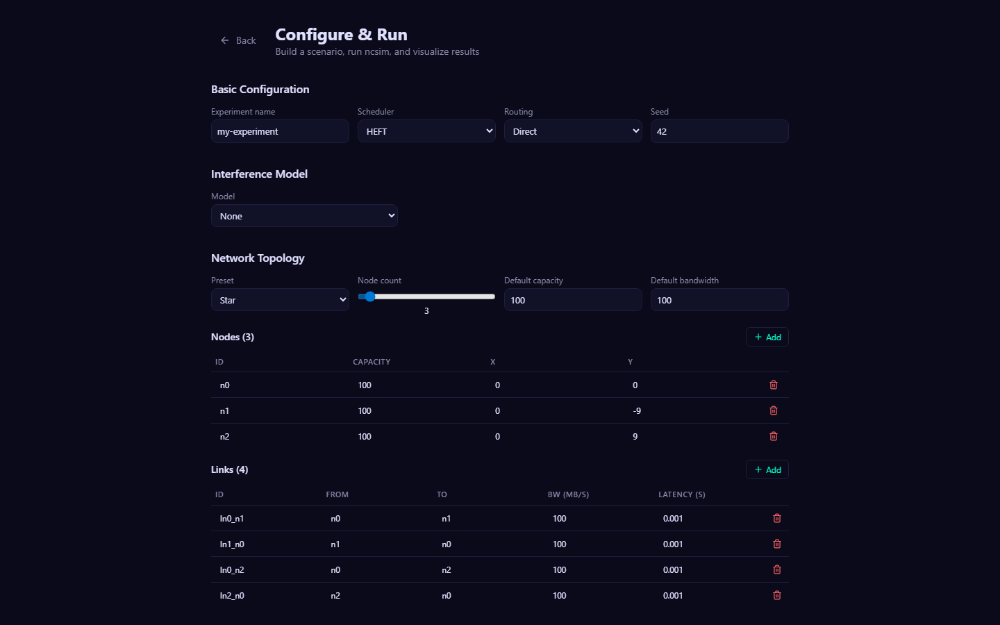
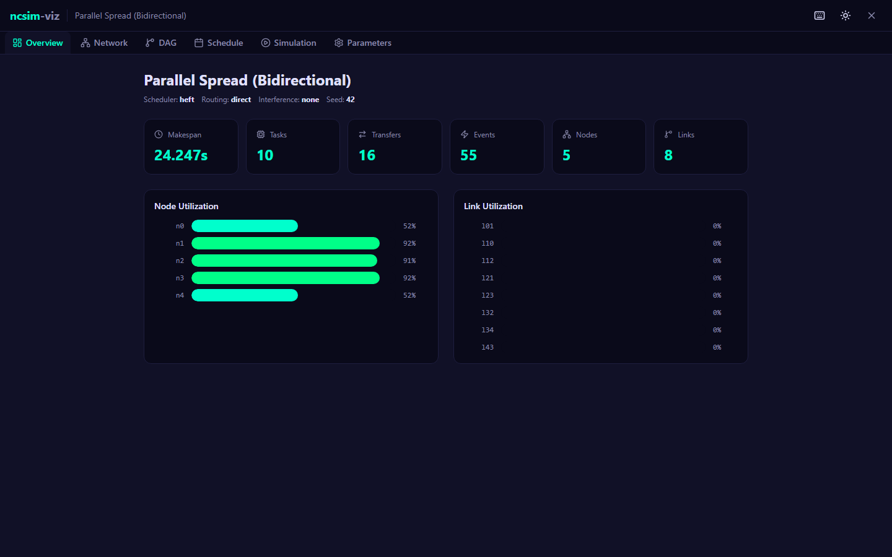
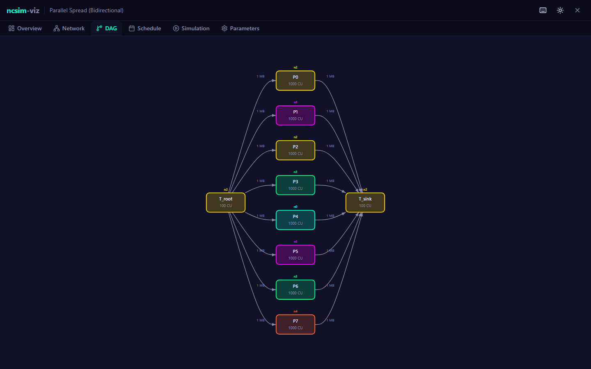
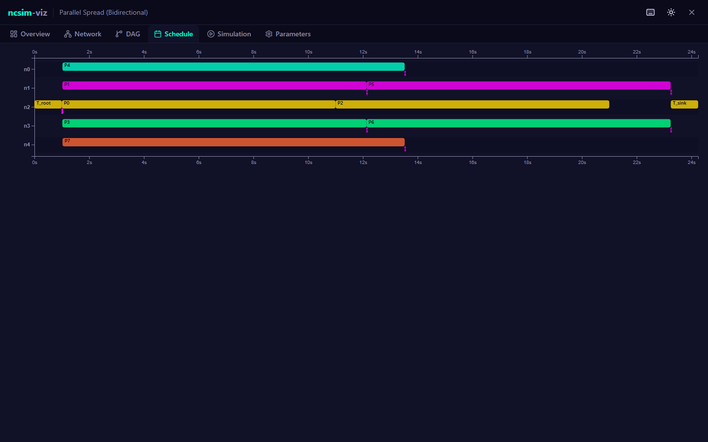
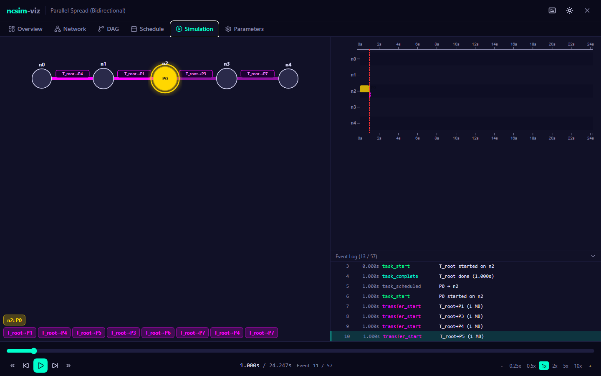

# ncsim

[](https://pypi.org/project/anrg-ncsim/)
[](https://doi.org/10.5281/zenodo.19138224)

**Networked Compute Simulator** — a headless discrete-event simulator for evaluating task scheduling algorithms on heterogeneous networked systems.

ncsim models compute nodes, network links with WiFi interference, and DAG task graphs. It produces detailed JSONL traces and JSON metrics for analysis.

## Features

- **Deterministic simulation**: Same inputs + same seed = identical results
- **HEFT/CPOP/Manual scheduling**: Integrated with [anrg-saga](https://github.com/ANRGUSC/saga) schedulers, plus manual assignment via `pinned_to`
- **Multi-hop routing**: Direct, widest-path (max-min bandwidth), and shortest-path (min-latency)
- **802.11 WiFi PHY/MAC**: Log-distance path loss, SNR-based MCS rate adaptation (802.11n/ac/ax)
- **Interference models**: Proximity, CSMA/CA clique-based, and CSMA/CA Bianchi (dynamic SINR)
- **Fair bandwidth sharing** when multiple transfers share a link
- **Experiment scripts** for interference verification and routing comparison
- **Documentation**: [installation guide](docs/installation.html), [user guide](docs/userguide.html), [architecture overview](docs/architecture.html), and [WiFi interference model](docs/wifi_interference_model.pdf)

## Installation

**Recommended:** Clone the repository to get started. The repo includes example scenarios, experiment scripts, documentation, and the [web visualization UI](#web-visualization-ncsim-viz) — all useful for learning and exploring ncsim:

```bash
git clone https://github.com/ANRGUSC/ncsim.git
cd ncsim
pip install -e .

# For development (includes pytest)
pip install -e ".[dev]"
```

Alternatively, `pip install anrg-ncsim` installs just the core simulator and `ncsim` CLI. This is suitable if you want to use ncsim as a library in your own project and will write your own scenario YAML files. It does not include the example scenarios, experiment scripts, visualization UI, or documentation.

Requires Python 3.10+ and [anrg-saga](https://github.com/ANRGUSC/saga) >= 2.0.3.

## Quick Start

```bash
ncsim --scenario scenarios/demo_simple.yaml --output results/
```

Output:
- `results/trace.jsonl` — event trace
- `results/metrics.json` — summary metrics
- `results/scenario.yaml` — copy of the input scenario

### CLI Options

```
ncsim --scenario PATH --output DIR [options]

Options:
  --seed N              Random seed (default: from scenario or 42)
  --scheduler ALGO      heft | cpop | round_robin | manual
  --routing ROUTING     direct | widest_path | shortest_path
  --interference MODEL  none | proximity | csma_clique | csma_bianchi
  --verbose             Enable verbose logging

WiFi / RF options (for csma_clique or csma_bianchi):
  --tx-power DBM        Transmit power in dBm (default: 20)
  --freq GHZ            Carrier frequency in GHz (default: 5.0)
  --path-loss-exp N     Path loss exponent (default: 3.0)
  --wifi-standard STD   n | ac | ax (default: ax)
  --rts-cts             Enable RTS/CTS
```

## Scenario Format

```yaml
scenario:
  name: "Simple Demo"
  network:
    nodes:
      - {id: n0, compute_capacity: 100, position: {x: 0, y: 0}}
      - {id: n1, compute_capacity: 50, position: {x: 10, y: 0}}
    links:
      - {id: l01, from: n0, to: n1, bandwidth: 100, latency: 0.001}
  dags:
    - id: dag_1
      inject_at: 0.0
      tasks:
        - {id: T0, compute_cost: 100}
        - {id: T1, compute_cost: 200}
      edges:
        - {from: T0, to: T1, data_size: 50}
  config:
    scheduler: heft
    seed: 42
```

Tasks can include `pinned_to: node_id` for use with `--scheduler manual`.

See [scenarios/](scenarios/) for more examples including WiFi interference, multi-hop routing, and parallel spread topologies.

## Experiment Scripts

Two standalone scripts for running structured experiments:

```bash
# Validate WiFi interference model against analytical predictions
python run_interference_verification.py

# Compare widest_path vs shortest_path routing on grid topologies
python run_routing_comparison.py
python visualize_routing_comparison.py  # Generate plots from results
```

## Trace Analysis

```bash
python analyze_trace.py results/trace.jsonl --gantt --timeline --tasks
```

## Running Tests

```bash
python -m pytest tests/ -v
```

178 tests covering event queue, execution engine, scheduling, routing, WiFi physics, and acceptance criteria.

## Architecture

For a detailed interactive overview, see [docs/architecture.html](https://htmlpreview.github.io/?https://github.com/ANRGUSC/ncsim/blob/main/docs/architecture.html).

```
ncsim/                  # Python package
├── main.py             # CLI entry point
├── core/
│   ├── simulation.py   # Main simulation loop
│   ├── event_queue.py  # Priority queue with deterministic ordering
│   └── execution_engine.py
├── models/
│   ├── network.py      # Node, Link, Network
│   ├── dag.py          # DAG, Edge, Task
│   ├── routing.py      # Direct, WidestPath, ShortestPath
│   ├── interference.py # Proximity, CSMA Clique, CSMA Bianchi
│   └── wifi.py         # 802.11 PHY/MAC
├── scheduler/
│   ├── base.py         # Scheduler interface
│   └── saga_adapter.py # SAGA HEFT/CPOP integration
└── io/
    ├── scenario_loader.py
    ├── trace_writer.py
    └── results_writer.py

scenarios/              # Example scenario YAML files (10 examples)
tests/                  # Unit and integration tests (8 test modules)
docs/                   # Documentation
├── architecture.html   # Interactive architecture overview
├── installation.html   # Installation guide
├── userguide.html      # User guide with screenshots
└── wifi_interference_model.pdf  # WiFi model writeup
```

---

## Web Visualization (ncsim-viz)

ncsim includes an optional web UI ([viz/](viz/)) for interactive experiment configuration and result visualization. The viz is not included in the PyPI package — clone the repository to use it.

### Setup

```bash
# Terminal 1: Backend API server
cd viz/server && pip install -r requirements.txt && python run.py

# Terminal 2: Frontend dev server
cd viz && npm install && npm run dev
```

Open **http://localhost:5173** to configure experiments, run simulations, and visualize results interactively. See [viz/README.md](viz/README.md) for full documentation.

### Configure & Run

Build a scenario interactively — choose a scheduler, routing strategy, interference model, topology preset (line, star, ring, mesh, grid), and DAG preset (chain, fork-join, diamond, parallel). Edit nodes, links, and tasks in editable tables, then run the experiment with one click.

<p align="center">
  
</p>

### Visualization Tabs

After running or loading an experiment, explore results across six tabs:

| Tab | Description |
|-----|-------------|
| **Overview** | Makespan, task/transfer counts, node and link utilization bars |
| **Network** | Interactive D3 topology with node capacity and bandwidth labels |
| **DAG** | Task dependency graph with tasks colored by assigned node |
| **Schedule** | Gantt chart showing task execution windows across all nodes |
| **Simulation** | Animated replay: synchronized network view + live Gantt + event log |
| **Parameters** | Full scenario config inspector |

<p align="center">
  <br>
  <em>Overview — summary dashboard with node utilization</em>
</p>

<p align="center">
  <br>
  <em>DAG — task dependency graph, colored by node assignment</em>
</p>

<p align="center">
  <br>
  <em>Schedule — Gantt chart of task execution across nodes</em>
</p>

<p align="center">
  <br>
  <em>Simulation — animated replay with live transfers, Gantt timeline, and event log</em>
</p>

The simulation replay supports keyboard shortcuts: Space (play/pause), arrow keys (step events), +/- (speed 0.25x-10x), and keys 1-6 to switch tabs.

```
viz/                    # Web visualization (React + FastAPI)
├── src/                # React frontend
├── server/             # FastAPI backend
└── public/             # Sample experiment runs
```

---

## Citation

If you use ncsim in your research, please cite it:

```bibtex
@software{krishnamachari2026ncsim,
  author    = {Krishnamachari, Bhaskar},
  title     = {ncsim: Headless Discrete Event Simulator for Networked Computing Research},
  version   = {1.0.0},
  year      = {2026},
  url       = {https://github.com/ANRGUSC/ncsim},
  doi       = {10.5281/zenodo.19138224}
}
```

## License

[MIT](LICENSE)

## Contributors
**Bhaskar Krishnamachari, Maya Gutierrez**  — [Autonomous Networks Research Group (ANRG)](https://anrg.usc.edu/), University of Southern California
