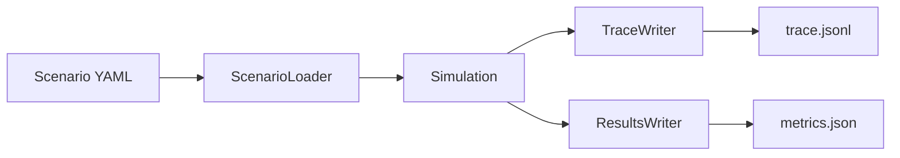
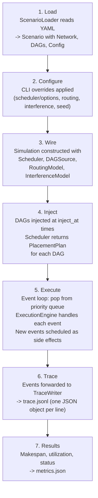
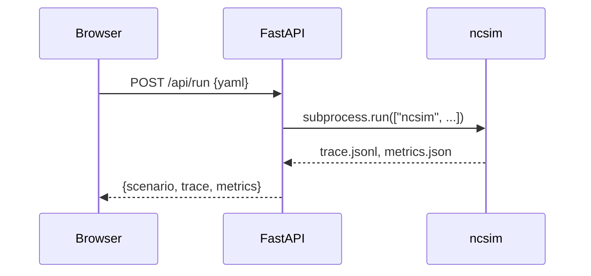

# Architecture

ncsim is a headless discrete event simulator for networked computing,
designed around pluggable abstractions for scheduling, routing, and
interference modeling. This page describes the package structure, data
flow, key abstractions, and the optional visualization frontend.

## Package Structure

```
ncsim/
├── main.py             # CLI entry point (argparse, orchestration)
├── core/
│   ├── simulation.py   # Main simulation loop (Simulation, SimulationResult)
│   ├── event_queue.py  # Priority queue with deterministic ordering
│   ├── execution_engine.py  # Event handlers, node/link state management
│   └── telemetry.py    # Pluggable telemetry collectors
├── models/
│   ├── network.py      # Node, Link, Position, Network dataclasses
│   ├── task.py         # Task, TaskState, TaskStatus, FIFOQueueModel
│   ├── dag.py          # DAG, Edge, DAGSource ABC
│   ├── routing.py      # RoutingModel ABC + 3 implementations
│   ├── interference.py # InterferenceModel ABC + 4 implementations
│   └── wifi.py         # 802.11 RF physics (PHY rates, conflict graph, Bianchi)
├── scheduler/
│   ├── base.py         # Scheduler ABC, PlacementPlan, RoundRobinScheduler
│   └── saga_adapter.py # Version-aware SAGA scheduler registry and adapter
└── io/
    ├── scenario_loader.py  # YAML parsing -> Scenario object
    ├── trace_writer.py     # JSONL trace output (event stream)
    └── results_writer.py   # metrics.json output (summary)
```

## Architecture Overview

The high-level data flow follows a linear pipeline from YAML input through
simulation to structured output files.



## Simulation Pipeline

The simulation proceeds through seven distinct phases. Each phase
transforms or consumes the output of the previous one.



### Phase Details

**1. Load.** The `ScenarioLoader` reads a YAML file and produces a
`Scenario` object containing a `Network` (nodes + links), a list of
`DAG` objects (tasks + edges), and a `ScenarioConfig` with defaults for
scheduler, routing, interference, and seed.

**2. Configure.** CLI arguments such as `--scheduler heft`,
`--scheduler-option alpha=0.75`,
`--routing widest_path`, or `--interference csma_bianchi` override the
values from the YAML config section. The `--seed` flag overrides the
scenario seed for reproducibility experiments.

**3. Wire.** The `Simulation` object is constructed, which internally
creates an `EventQueue` and an `ExecutionEngine`. The engine receives
handles to the `Network`, `Scheduler`, `RoutingModel`, and optionally an
`InterferenceModel`.

**4. Inject.** The `DAGSource` (either `SingleDAGSource` or
`MultiDAGSource`) provides DAGs at their specified `inject_at` times. For
each DAG, a `DAG_INJECT` event is placed on the queue. When that event is
processed, the scheduler's `on_dag_inject` method is called, returning a
`PlacementPlan` that maps every task to a node.

**5. Execute.** The main loop pops events from the priority queue one at a
time. Each event is dispatched to the appropriate handler in the
`ExecutionEngine`, which may schedule new events as side effects. The loop
continues until the queue is empty.

**6. Trace.** A `TraceEventAdapter` listens to every processed event and
writes structured records to a JSONL file via `TraceWriter`. Each record
includes a sequence number, simulation time, event type, and
event-specific fields.

**7. Results.** After the loop completes, the `ResultsWriter` computes
makespan, per-node utilization, per-link utilization, and simulation
status, then writes everything to `metrics.json`.

## Key Abstractions

ncsim uses abstract base classes (ABCs) at every extension point.
Swapping behavior requires only implementing the ABC and selecting it
via CLI flag or YAML config.

| Abstraction | Interface | Implementations | Configured by |
|---|---|---|---|
| **Scheduler** | `on_dag_inject(dag, snapshot) -> PlacementPlan` | `RoundRobinScheduler`, `ManualScheduler`, and 22+ algorithms through `SagaScheduler` | `--scheduler`, `--scheduler-option` |
| **RoutingModel** | `get_path(src, dst, network) -> [link_ids]` | `DirectLinkRouting`, `WidestPathRouting`, `ShortestPathRouting` | `--routing` |
| **InterferenceModel** | `get_interference_factor(link, actives, net) -> float` | `NoInterference`, `ProximityInterference`, `CsmaCliqueInterference`, `CsmaBianchiInterference` | `--interference` |
| **DAGSource** | `get_next_injection(after_time) -> (time, dag)` | `SingleDAGSource`, `MultiDAGSource` | Scenario YAML |
| **TelemetryCollector** | `on_event(event, engine)` | `TraceOnlyCollector`, `FullStateCollector` | Internal |
| **QueueModel** | `enqueue(task)`, `dequeue() -> task` | `FIFOQueueModel` | Internal |

### Scheduler

The scheduler decides **where** tasks run. It receives a DAG and a
`NetworkSnapshot` (read-only view of nodes and links with capacities and
bandwidths), and returns a `PlacementPlan` mapping every task ID to a node
ID. The execution engine decides **when** tasks run based on event
ordering and node availability.

!!! info "Pinned tasks"
    Any task with a `pinned_to` field in the YAML overrides the
    scheduler's assignment. This works with every built-in and registered
    SAGA scheduler.

### RoutingModel

The routing model determines the path (sequence of link IDs) for
data transfers between nodes. `DirectLinkRouting` requires an explicit
link and fails if none exists. `WidestPathRouting` finds the path that
maximizes bottleneck bandwidth using modified Dijkstra. `ShortestPathRouting`
minimizes total latency using standard Dijkstra.

### InterferenceModel

The interference model computes a multiplicative factor in (0, 1] applied
to a link's base bandwidth when other links are simultaneously active.
This is orthogonal to per-link fair sharing: if a link has base bandwidth
B, interference factor f, and N concurrent transfers, each transfer gets
`(B * f) / N`.

### DAGSource

A DAGSource provides DAGs for injection into the simulation at specified
times. `SingleDAGSource` injects one DAG. `MultiDAGSource` injects
multiple DAGs sorted by their `inject_at` times.

## Extensibility

!!! tip "Adding new models"
    To add a new scheduling algorithm, routing model, or interference
    model, implement the corresponding ABC and register it in the CLI
    argument choices and factory function.

The ABC-based architecture supports the following future extensions without
modifying the core simulation loop:

- **RL-based scheduling** -- Implement `Scheduler.on_dag_inject` with a
  trained policy network.
- **Preemptive tasks** -- Extend `QueueModel` with priority-based
  preemption; the `TaskState` already tracks `compute_remaining`.
- **TDMA links** -- Implement a `LinkModel` that returns time-varying
  bandwidth based on slot schedules. The `EventType` enum already
  reserves `TDMA_SLOT_START`.
- **Mobility** -- Schedule `MOBILITY_UPDATE` events that recompute
  positions and update link bandwidths. The event type is already
  reserved.
- **Jamming / disruptions** -- Schedule `LINK_STATE_CHANGE` events that
  degrade or disable links mid-simulation.

## Visualization Architecture

ncsim includes an optional web-based visualization frontend (`viz/`
directory) for interactive trace playback and scenario editing.

### Stack

| Layer | Technology |
|---|---|
| Frontend | React 19, TypeScript, Vite |
| Layout & graphics | D3.js (network graph), Dagre (DAG layout) |
| Styling | Tailwind CSS 4 |
| Backend | FastAPI + uvicorn (Python) |
| Simulation | ncsim invoked as subprocess |

### Communication

The frontend development server (Vite, port 5173) proxies all `/api/*`
requests to the FastAPI backend running on port 8000. The backend
accepts scenario YAML, runs ncsim as a subprocess, and returns the
parsed trace and metrics to the browser.



The browser receives the full simulation output in a single response
and renders an interactive timeline with network topology, DAG
structure, and event-by-event playback.
