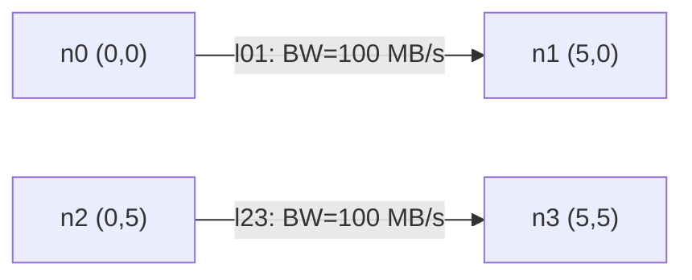

# Interference Models

Interference models reduce the effective bandwidth of a link when multiple
nearby links are simultaneously active. This inter-link contention is applied
**on top of** per-link fair sharing (where N flows on the same link each get
`bandwidth / N`).

The combined formula for a single flow on a link is:

```
effective_bw = (base_bandwidth * interference_factor) / num_flows_on_link
```

The interference model is selected via the `interference` key in the scenario
YAML or the `--interference` CLI flag.

---

## None (`none`)

No inter-link interference. The interference factor is always **1.0**.

- Links operate at their full declared bandwidth regardless of concurrent
  transfers on other links.
- Appropriate for **wired networks** or scenarios where spectrum contention
  is not relevant.

```yaml
config:
  interference: none
```

---

## Proximity (`proximity`)

A simple distance-based interference model.  Links whose geometric midpoints
fall within a configurable radius are considered to be **contending**.

- If **k** active links (including the link being evaluated) have midpoints
  within the radius, the interference factor is `1/k`.
- Configure the radius with the `interference_radius` YAML key or the
  `--interference-radius` CLI flag (default: **15.0 meters**).
- **Dynamic**: the factor is recalculated whenever a transfer starts or
  completes.
- Provides a quick approximation of spectrum contention without requiring
  WiFi-specific RF parameters.

```yaml
config:
  interference: proximity
  interference_radius: 10.0
```

---

## CSMA/CA Clique (`csma_clique`)

An 802.11-aware static model that builds a **conflict graph** based on carrier
sensing rules and divides bandwidth by the worst-case clique size.

- Uses RF propagation (path loss, carrier sensing threshold) to determine
  which links can sense each other's transmissions.
- Links that can sense each other form edges in a **conflict graph**.
  The Bron-Kerbosch algorithm (exact for networks with 50 or fewer links;
  greedy approximation otherwise) finds the maximum clique containing each
  link.
- At setup time, each link's bandwidth is set to:

    ```
    link.bandwidth = PHY_rate / max_clique_size
    ```

- After setup, the interference factor is always **1.0** -- contention is
  baked into the bandwidth value and does not change during simulation.
- **Conservative**: represents the worst-case bound where all links in the
  largest clique transmit simultaneously.
- Requires RF parameters (`tx_power_dBm`, `freq_ghz`, `path_loss_exponent`,
  `cca_threshold_dBm`, etc.) via the `rf:` YAML section.

```yaml
config:
  interference: csma_clique
  rf:
    tx_power_dBm: 20
    freq_ghz: 5.0
    path_loss_exponent: 3.0
```

---

## CSMA/CA Bianchi (`csma_bianchi`)

The most realistic WiFi interference model. It **dynamically** separates two
distinct interference mechanisms:

### 1. Contention Domain (Conflict Graph Neighbors)

Links that appear as neighbors in the conflict graph operate under CSMA/CA:
they **cannot transmit simultaneously**. Instead, they share airtime according
to Bianchi's saturation throughput model.

Each of **n** contending links (including the link itself) gets a fraction
`eta(n) / n` of the channel, where `eta(n)` is the Bianchi MAC efficiency
for n stations.

Because CSMA prevents simultaneous transmission, contending links do **not**
cause SINR degradation at each other's receivers.

### 2. Hidden Terminals (Non-Conflict-Graph Neighbors)

Active links that are **not** in the conflict graph of the evaluated link may
transmit simultaneously, causing RF interference at the receiver. Their
combined interference power degrades the SINR, which may force a lower MCS
rate.

The SINR-based rate (`R_SINR`) is computed using only hidden terminal
interference. The base rate (`R_base`) is the SNR-only PHY rate.

### Combined Factor

```
factor = (R_SINR / R_base) * (eta(n) / n)
```

Where:

- `n = 1 + |active contending neighbors|`
- `eta(n)` = Bianchi MAC efficiency for n stations
- `R_SINR` = MCS rate under SINR (hidden terminal degradation)
- `R_base` = MCS rate under SNR only (no interference)

The factor is **recalculated** whenever a transfer starts or completes,
making this a fully dynamic model.

```yaml
config:
  interference: csma_bianchi
  rf:
    tx_power_dBm: 20
    freq_ghz: 5.0
    path_loss_exponent: 3.0
    noise_floor_dBm: -95
    cca_threshold_dBm: -82
    channel_width_mhz: 20
    wifi_standard: "ax"
```

!!! note "Key insight"
    CSMA prevents simultaneous transmission within the contention domain, so
    contending links affect throughput via **time-sharing**, not via SINR
    degradation. Only hidden terminals -- links outside the conflict graph --
    contribute to SINR reduction. This separation is what distinguishes
    `csma_bianchi` from simpler models.

---

## Comparison

| Feature | None | Proximity | CSMA Clique | CSMA Bianchi |
|---|---|---|---|---|
| **Interference type** | None | Distance-based | Carrier sensing | SINR + MAC |
| **Dynamic** | N/A | Yes | No (static) | Yes |
| **WiFi-aware** | No | No | Yes | Yes |
| **RF parameters required** | No | No | Yes | Yes |
| **Accuracy** | N/A | Low | Medium | High |
| **Use case** | Wired networks | Quick approximation | WiFi without SINR | Realistic WiFi |

---

## Worked Example: Proximity Interference

This example uses the `interference_test.yaml` scenario.

### Topology

Four nodes with two parallel links, 5 units apart:



- Link `l01` midpoint: (2.5, 0)
- Link `l23` midpoint: (2.5, 5)
- Distance between midpoints: **5.0 units**

Two DAG edges create simultaneous transfers: T0 -> T1 on `l01` (100 MB) and
T2 -> T3 on `l23` (100 MB). Each task has `compute_cost: 10` on nodes with
`compute_capacity: 1000`, so task execution takes 0.01 s.

### Without Interference (`none`)

| Transfer | Bandwidth | Time | Total |
|---|---|---|---|
| T0 -> T1 on l01 | 100 MB/s | 100 / 100 = 1.0 s | 0.01 + 1.0 + 0.01 = 1.02 s |
| T2 -> T3 on l23 | 100 MB/s | 100 / 100 = 1.0 s | 0.01 + 1.0 + 0.01 = 1.02 s |

**Makespan: 1.02 s**

### With Proximity Interference (`radius=10`)

Since the midpoint distance (5.0) is less than the radius (10.0), both links
contend. With k=2 active contending links, the interference factor is `1/k = 0.5`.

| Transfer | Effective BW | Time | Total |
|---|---|---|---|
| T0 -> T1 on l01 | 100 * 0.5 = 50 MB/s | 100 / 50 = 2.0 s | 0.01 + 2.0 + 0.01 = 2.02 s |
| T2 -> T3 on l23 | 100 * 0.5 = 50 MB/s | 100 / 50 = 2.0 s | 0.01 + 2.0 + 0.01 = 2.02 s |

**Makespan: 2.02 s** -- transfers take 2x longer due to interference.

---

## YAML Configuration

### Proximity Model

```yaml
config:
  interference: proximity
  interference_radius: 15.0   # meters (default)
```

### WiFi Models (Clique or Bianchi)

```yaml
config:
  interference: csma_bianchi   # or csma_clique
  rf:
    tx_power_dBm: 20
    freq_ghz: 5.0
    path_loss_exponent: 3.0
    noise_floor_dBm: -95
    cca_threshold_dBm: -82
    channel_width_mhz: 20
    wifi_standard: "ax"
    shadow_fading_sigma: 0.0
    rts_cts: false
```

### CLI Overrides

```bash
ncsim --scenario my_scenario.yaml --output results/ \
      --interference proximity --interference-radius 10.0

ncsim --scenario my_scenario.yaml --output results/ \
      --interference csma_bianchi --tx-power 20 --freq 5.0 \
      --path-loss-exponent 3.0 --wifi-standard ax --rts-cts
```
