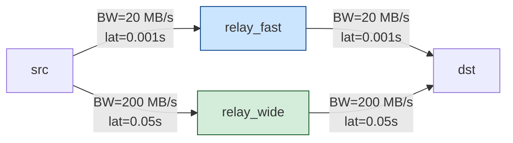

# Routing Modes

ncsim supports three routing modes that determine how data flows between nodes
in the network. The routing mode is set via the `routing` key in the scenario
YAML or the `--routing` CLI flag.

---

## Direct Routing (`direct`)

Single-hop routing that transfers data only on a direct link between the source
and destination nodes.

- **No multi-hop**: if no direct link exists between two nodes, the transfer
  fails immediately.
- **Simplest and fastest**: no path computation, no caching overhead.
- **Best for**: topologies where every communicating pair of nodes has a
  dedicated link.

```yaml
config:
  routing: direct
```

!!! warning "Transfer failure"
    Direct routing will **fail** any transfer where the source and destination
    are not connected by a single declared link.  If your scheduler may assign
    communicating tasks to non-adjacent nodes, use `widest_path` or
    `shortest_path` instead.

---

## Widest Path Routing (`widest_path`)

Routes data along the path that **maximizes the bottleneck bandwidth**
(max-min bandwidth). This is the optimal choice when transfer size dominates
total transfer time.

- **Algorithm**: modified Dijkstra using a max-heap. At each step the
  algorithm relaxes edges by taking `min(current_bottleneck, link_bandwidth)`,
  keeping the path whose minimum-bandwidth link is largest.
- **Multi-hop**: intermediate nodes act as store-and-forward relays.
- **Caching**: paths are computed once and cached for the lifetime of the
  simulation. Call `clear_cache()` if the topology changes.
- **Transfer model**: bottleneck bandwidth determines transfer rate; latencies
  are **summed** across all hops (store-and-forward).

```yaml
config:
  routing: widest_path
```

---

## Shortest Path Routing (`shortest_path`)

Routes data along the path that **minimizes total latency** (sum of per-link
latencies). When all links have equal latency this degenerates to minimum hop
count.

- **Algorithm**: standard Dijkstra on link latencies (min-heap).
- **Multi-hop**: intermediate nodes act as store-and-forward relays.
- **Caching**: paths are computed once and cached.
- **Transfer model**: latencies are summed; bottleneck bandwidth along the
  chosen path determines transfer rate.

```yaml
config:
  routing: shortest_path
```

---

## Comparison

| Feature | Direct | Widest Path | Shortest Path |
|---|---|---|---|
| **Algorithm** | Direct lookup | Modified Dijkstra (max-min BW) | Standard Dijkstra (min latency) |
| **Multi-hop** | No | Yes | Yes |
| **Optimizes** | N/A | Bottleneck bandwidth | Total latency |
| **Fails when** | No direct link exists | No path exists | No path exists |
| **Path caching** | N/A | Yes | Yes |
| **Best for** | Simple topologies | Large transfers | Small / latency-sensitive transfers |

---

## When Widest and Shortest Diverge

The two multi-hop modes choose **different paths** whenever a topology offers
a trade-off between bandwidth and latency. Consider a diamond topology with
two relay nodes:



**Shortest path** picks `src -> relay_fast -> dst` (total latency 0.002 s,
bottleneck BW 20 MB/s).

**Widest path** picks `src -> relay_wide -> dst` (total latency 0.1 s,
bottleneck BW 200 MB/s).

### Worked Example -- 100 MB Transfer

This corresponds to the `widest_vs_shortest.yaml` scenario, where tasks T0
(on `src`) and T1 (on `dst`) are connected by a 100 MB data edge.  Each task
has `compute_cost: 100` on nodes with `compute_capacity: 100`, so each task
takes 1.0 s to execute.

| | Shortest Path | Widest Path |
|---|---|---|
| **Path** | src -> relay_fast -> dst | src -> relay_wide -> dst |
| **Bottleneck BW** | 20 MB/s | 200 MB/s |
| **Total latency** | 0.002 s | 0.1 s |
| **Transfer time** | 100 / 20 + 0.002 = 5.002 s | 100 / 200 + 0.1 = 0.6 s |
| **Makespan** | 1.0 + 5.002 + 1.0 = **7.002 s** | 1.0 + 0.6 + 1.0 = **2.6 s** |

Widest-path routing is approximately **2.7x faster** for this large transfer
because the data volume dominates the total time, making bandwidth the
controlling factor.

!!! tip "Rule of thumb"
    Use `widest_path` when transfer sizes are large relative to link
    latencies. Use `shortest_path` when transfers are small and latency
    dominates.

---

## When Multi-hop Routing Is Needed

!!! info "Why multi-hop matters"
    Multi-hop routing is required whenever the scheduler assigns communicating
    tasks to **non-adjacent** nodes -- that is, nodes with no direct link
    between them. Without `widest_path` or `shortest_path` routing, the
    transfer will fail because `direct` routing cannot relay through
    intermediate nodes.

    This commonly occurs with HEFT and CPOP schedulers, which choose node
    assignments based on compute speed and may place dependent tasks on nodes
    that are not directly connected.

---

## YAML Configuration

Routing is specified in the `config` section:

```yaml
scenario:
  config:
    routing: widest_path   # "direct", "widest_path", or "shortest_path"
```

Or overridden on the command line:

```bash
ncsim --scenario my_scenario.yaml --output results/ --routing shortest_path
```
