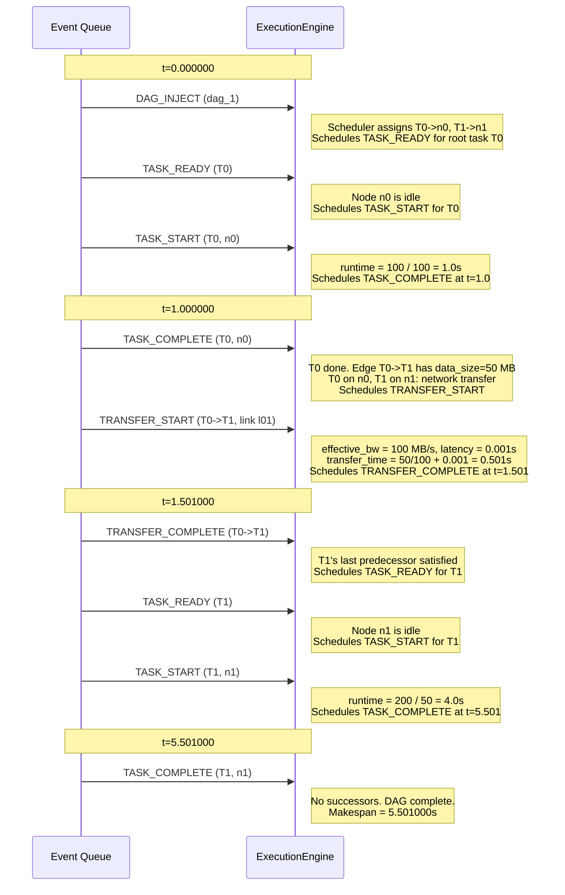

# Simulation Model

ncsim uses a **discrete event simulation** (DES) to model task execution
and data transfer across a networked computing environment. This page
covers the event model, time management, compute and transfer
calculations, and bandwidth sharing mechanics.

## Discrete Event Simulation Basics

A discrete event simulation advances time by jumping from one event to the
next, rather than stepping through fixed time increments. The core loop is:

1. Pop the highest-priority event from the queue.
2. Advance the simulation clock to that event's time.
3. Execute the event handler, which may schedule new events.
4. Repeat until the queue is empty.

!!! info "No fixed time step"
    Unlike tick-based simulations, DES skips idle periods entirely. A
    simulation with two events at t=0.0 and t=100.0 processes only those
    two events, regardless of the 100-second gap between them.

This approach gives ncsim exact timing for task completions and data
transfers without discretization error.

## Event Types

ncsim defines six core event types, each with a fixed priority value.
Lower priority values are processed first when multiple events occur at
the same simulation time.

| Event Type | Priority | Description |
|---|---|---|
| `DAG_INJECT` | 0 | A new DAG arrives and is handed to the scheduler |
| `TASK_COMPLETE` | 1 | A task finishes execution on its assigned node |
| `TRANSFER_COMPLETE` | 2 | A data transfer finishes on its link path |
| `TASK_READY` | 3 | All predecessors of a task are satisfied |
| `TASK_START` | 4 | A task begins execution on a node |
| `TRANSFER_START` | 5 | A data transfer begins on a link |

!!! note "Why completions come before starts"
    At the same simulation time, completions must be processed before
    starts. When a task completes, it frees its node and triggers output
    transfers. Those transfers may complete instantly (same-node), making
    a downstream task ready. If starts were processed first, the
    downstream task could miss being scheduled at the correct time.

Four additional event types are reserved for future extensions:
`MOBILITY_UPDATE` (100), `LINK_STATE_CHANGE` (101),
`RESCHEDULE_TRIGGER` (102), and `TDMA_SLOT_START` (103). Their handlers
currently no-op.

## Event Ordering

Events are stored in a min-heap (priority queue) and ordered by a
three-element sort key:

```
(round(sim_time, 6), event_type.priority, event_id)
```

| Component | Purpose |
|---|---|
| `round(sim_time, 6)` | Microsecond precision avoids floating-point comparison issues |
| `event_type.priority` | Ensures correct causal ordering at the same time instant |
| `event_id` | Monotonically increasing counter guarantees FIFO order for ties |

This three-level ordering guarantees **determinism**: given the same
inputs and the same seed, the simulation produces an identical event
sequence every time.

### Event Cancellation

The queue supports lazy cancellation. When a transfer's completion time
is recalculated (due to bandwidth sharing changes), the old completion
event is added to a cancelled set. When the queue pops a cancelled event,
it silently discards it and pops the next one. This avoids the cost of
heap removal while maintaining correctness.

## Determinism

!!! success "Reproducibility guarantee"
    Same scenario YAML + same `--seed` = identical event sequence,
    identical makespan, identical trace output.

Determinism comes from three sources:

1. **Microsecond rounding** -- All times are rounded to 6 decimal places
   via `round_time()`, eliminating platform-dependent floating-point
   drift.
2. **Priority-based ordering** -- Event type priorities impose a fixed
   processing order at each time instant.
3. **Monotonic event IDs** -- A global counter breaks all remaining ties
   in insertion order.

## Compute Model

Each node has a `compute_capacity` measured in compute units per second.
Each task has a `compute_cost` measured in compute units. The execution
time is:

```
task_runtime = compute_cost / node.compute_capacity
```

For example, a task with `compute_cost: 200` on a node with
`compute_capacity: 100` takes 2.0 seconds.

### Node Queuing

Each node runs **at most one task at a time** (single-server model).
When a task becomes ready and its assigned node is busy, the task enters
a FIFO queue on that node. Tasks are dequeued and started in arrival
order when the node becomes idle.

!!! warning "No preemption"
    A running task always completes before any queued task starts. The
    `TaskState` dataclass tracks `compute_remaining` to support future
    preemptive scheduling, but the current engine does not interrupt
    running tasks.

### Task Lifecycle

A task moves through these statuses:

| Status | Meaning |
|---|---|
| `PENDING` | Waiting for predecessor tasks to complete |
| `READY` | All predecessors complete; waiting for node availability |
| `QUEUED` | In the node's FIFO queue (node is busy) |
| `RUNNING` | Executing on the node |
| `COMPLETED` | Finished execution |

## Transfer Model

When a task completes, the engine schedules data transfers for each
outgoing edge in the DAG. Transfers move data from the source task's
node to the destination task's node over a network path.

### Local Transfers

If the source and destination tasks are assigned to the **same node**,
no network transfer occurs. The predecessor is marked complete
immediately at zero cost.

### Network Transfers

For tasks on different nodes, the routing model determines a path
(sequence of link IDs). The transfer time is:

```
transfer_time = (data_size / effective_bandwidth) + total_latency
```

Where:

- **`data_size`** is the edge's `data_size` in MB.
- **`effective_bandwidth`** is the bottleneck bandwidth across all links
  in the path, after accounting for per-link fair sharing and
  interference.
- **`total_latency`** is the sum of all link latencies along the path
  (store-and-forward model).

### Multi-Hop Paths

For paths with more than one link:

- **Bottleneck bandwidth** = minimum bandwidth across all links in the
  path.
- **Total latency** = sum of latencies across all links (each hop adds
  its propagation delay).

The store-and-forward model means data must fully arrive at each
intermediate node before being forwarded to the next hop.

## Bandwidth Sharing

When multiple transfers use the same link simultaneously, they share the
link's bandwidth equally. If N transfers share a link with base bandwidth
B (after interference), each gets `B / N`.

!!! note "Dynamic recalculation"
    When a transfer starts or completes on a link, the engine
    recalculates the completion times of **all other active transfers**
    on that link. Old completion events are cancelled and replaced with
    new ones reflecting the updated bandwidth allocation.

The recalculation accounts for partial progress. When bandwidth changes
mid-transfer:

1. The engine computes how much data was transferred at the previous
   rate during the elapsed time.
2. It subtracts that from `data_remaining`.
3. It schedules a new completion event based on the remaining data and
   the new effective rate.

For multi-hop transfers, the effective bandwidth is the minimum across
all links in the path, each independently sharing its bandwidth among
its concurrent transfers.

### Interference Effects on Bandwidth

When an `InterferenceModel` is active, bandwidth sharing becomes a
two-level calculation:

1. **Interference factor**: The model returns a factor f in (0, 1] for
   each link based on other active links in the network (e.g., nearby
   wireless transmitters).
2. **Per-link fair sharing**: N concurrent transfers on the link each get
   `(B * f) / N`.

Interference factors are recomputed whenever any transfer starts or
completes, and affected transfers have their completion times
recalculated.

## Example: Two-Task Execution

The following diagram shows the event sequence for a simple scenario with
two tasks (T0 and T1) where T1 depends on T0 and they are assigned to
different nodes.



!!! tip "Tracing this locally"
    Run this exact scenario with:
    ```
    ncsim --scenario scenarios/demo_simple.yaml --output results/ -v
    ```
    The verbose flag (`-v`) logs every event to the console. The
    output directory will contain `trace.jsonl` and `metrics.json`.

## Output Files

### trace.jsonl

One JSON object per line, in event order. Every record has:

| Field | Type | Description |
|---|---|---|
| `seq` | int | Monotonically increasing sequence number |
| `sim_time` | float | Simulation time in seconds (6 decimal places) |
| `type` | string | Event type (`dag_inject`, `task_start`, `task_complete`, `transfer_start`, `transfer_complete`, `sim_start`, `sim_end`) |

Additional fields vary by event type (e.g., `dag_id`, `task_id`,
`node_id`, `link_id`, `duration`, `data_size`).

### metrics.json

A single JSON object with summary metrics:

| Field | Type | Description |
|---|---|---|
| `scenario` | string | Scenario file name |
| `seed` | int | Random seed used |
| `makespan` | float | Time of last task completion |
| `total_tasks` | int | Number of tasks across all DAGs |
| `total_transfers` | int | Number of data transfer edges |
| `total_events` | int | Total events processed |
| `status` | string | `"completed"` or `"error"` |
| `node_utilization` | object | Per-node busy_time / makespan (0.0 to 1.0) |
| `link_utilization` | object | Per-link data_transferred / (bandwidth * makespan) |
