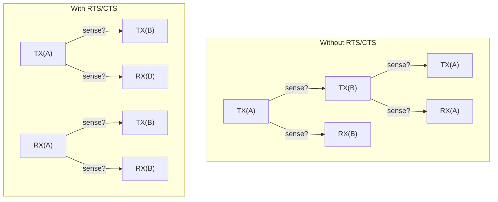
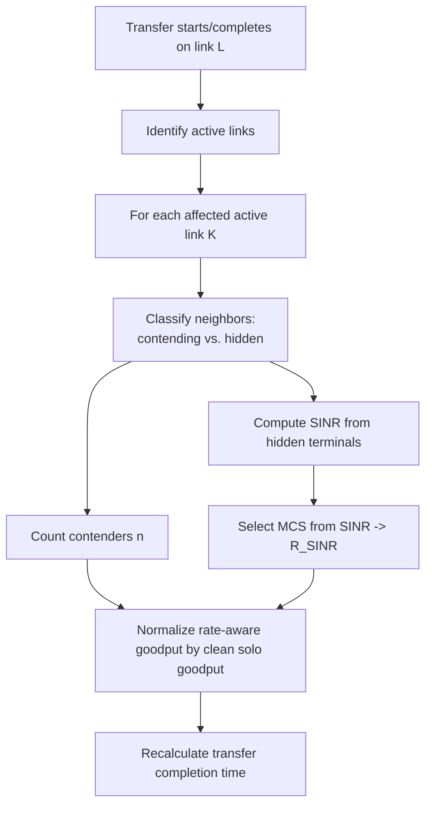

# WiFi Model

The WiFi model derives link rates from propagation, SNR-based MCS selection,
and 802.11 MAC contention. Explicit link bandwidths specify clean PHY rates;
Solo and Full modes apply MAC overhead to those rates too. See
[wireless modes](wireless-modes.md) for the canonical API and optional treatment.

The implementation lives in two modules:

- `ncsim/models/wifi.py` -- RF propagation, MCS tables, conflict graph
  construction, Bianchi MAC efficiency
- `ncsim/models/interference.py` -- `CsmaCliqueInterference` and
  `CsmaBianchiInterference` classes

---

## Path Loss and Received Power

ncsim uses the **log-distance path loss model** with a Friis free-space
reference at distance d0 = 1 m.

### Friis Reference Loss

The free-space path loss at the reference distance d0:

```
PL(d0) = 20 * log10(4 * pi * d0 * f / c)
```

At 5 GHz with d0 = 1 m, this evaluates to approximately **46.4 dB**.
At 2.4 GHz with d0 = 1 m, approximately **40.0 dB**.

### Log-Distance Path Loss

For distance d >= d0:

```
PL(d) = PL(d0) + 10 * n * log10(d / d0)
```

Where **n** is the path loss exponent:

| Environment | Typical n |
|---|---|
| Free space | 2.0 |
| Indoor (open office) | 2.5 - 3.0 |
| Indoor (with walls) | 3.0 - 4.0 |
| Dense indoor | 4.0 - 5.0 |

### Received Power

```
Prx(d) = Ptx - PL(d) - X_SF
```

Where `X_SF` is the shadow fading component (0 by default, see
[Shadow Fading](#shadow-fading) below).

### SNR

Signal-to-noise ratio in dB:

```
SNR = Prx - N0
```

Where `N0` is the noise floor (default -95 dBm).

---

## MCS Rate Adaptation

The received SNR selects the **highest MCS** (Modulation and Coding Scheme)
whose minimum SNR threshold is met. If the SNR falls below 5 dB (the lowest
threshold), the link is considered **not viable** and the rate is 0.

### MCS Tables (1 Spatial Stream, 20 MHz Base)

#### 802.11n (HT)

| MCS | Modulation | Min SNR (dB) | Rate (Mbps) |
|---|---|---|---|
| 0 | BPSK 1/2 | 5 | 6.5 |
| 1 | QPSK 1/2 | 8 | 13.0 |
| 2 | QPSK 3/4 | 11 | 19.5 |
| 3 | 16-QAM 1/2 | 14 | 26.0 |
| 4 | 16-QAM 3/4 | 18 | 39.0 |
| 5 | 64-QAM 2/3 | 22 | 52.0 |
| 6 | 64-QAM 3/4 | 25 | 58.5 |
| 7 | 64-QAM 5/6 | 29 | 65.0 |

#### 802.11ac (VHT)

| MCS | Modulation | Min SNR (dB) | Rate (Mbps) |
|---|---|---|---|
| 0 | BPSK 1/2 | 5 | 6.5 |
| 1 | QPSK 1/2 | 8 | 13.0 |
| 2 | QPSK 3/4 | 11 | 19.5 |
| 3 | 16-QAM 1/2 | 14 | 26.0 |
| 4 | 16-QAM 3/4 | 18 | 39.0 |
| 5 | 64-QAM 2/3 | 22 | 52.0 |
| 6 | 64-QAM 3/4 | 25 | 58.5 |
| 7 | 64-QAM 5/6 | 29 | 65.0 |
| 8 | 256-QAM 3/4 | 32 | 78.0 |
| 9 | 256-QAM 5/6 | 35 | 86.7 |

#### 802.11ax (HE)

| MCS | Modulation | Min SNR (dB) | Rate (Mbps) |
|---|---|---|---|
| 0 | BPSK 1/2 | 5 | 8.6 |
| 1 | QPSK 1/2 | 8 | 17.2 |
| 2 | QPSK 3/4 | 11 | 25.8 |
| 3 | 16-QAM 1/2 | 14 | 34.4 |
| 4 | 16-QAM 3/4 | 18 | 51.6 |
| 5 | 64-QAM 2/3 | 22 | 68.8 |
| 6 | 64-QAM 3/4 | 25 | 77.4 |
| 7 | 64-QAM 5/6 | 29 | 86.0 |
| 8 | 256-QAM 3/4 | 32 | 103.2 |
| 9 | 256-QAM 5/6 | 35 | 114.7 |
| 10 | 1024-QAM 3/4 | 38 | 129.0 |
| 11 | 1024-QAM 5/6 | 41 | 143.4 |

### Summary by Standard

| Standard | MCS Range | Peak Rate (20 MHz) | Modulation Range |
|---|---|---|---|
| 802.11n | 0--7 | 65.0 Mbps | BPSK -- 64-QAM |
| 802.11ac | 0--9 | 86.7 Mbps | BPSK -- 256-QAM |
| 802.11ax | 0--11 | 143.4 Mbps | BPSK -- 1024-QAM |

### Channel Width Scaling

Rates scale **linearly** with channel width. The table values are for
20 MHz; multiply by the channel width factor:

| Channel Width | Factor |
|---|---|
| 20 MHz | 1x |
| 40 MHz | 2x |
| 80 MHz | 4x |
| 160 MHz | 8x |

For example, 802.11ax MCS 11 at 80 MHz: 143.4 * 4 = 573.6 Mbps.

### Unit Conversion

ncsim uses **MB/s** internally for bandwidth. PHY rates are converted:

```
rate_MBps = rate_Mbps / 8
```

---

## Conflict Graph

The conflict graph determines which links **cannot transmit simultaneously**
under the 802.11 CSMA/CA protocol model.

### Carrier Sensing Range

The maximum distance at which a transmission triggers Clear Channel Assessment
(CCA):

```
d_CS = d0 * 10^((Ptx - theta_CCA - PL(d0)) / (10 * n))
```

Where `theta_CCA` is the CCA threshold (default -82 dBm).

### Conflict Rules

Two links A and B conflict if carrier sensing prevents them from transmitting
at the same time.

**Without RTS/CTS** (default): links A and B conflict if:

- Transmitter of A can sense **any node** of link B, **OR**
- Transmitter of B can sense **any node** of link A

"Can sense" means the distance between the two nodes is within the carrier
sensing range.

**With RTS/CTS** (`rts_cts: true`): links A and B conflict if:

- **Any node** of link A can sense **any node** of link B

RTS/CTS extends the conflict zone to protect receivers, which reduces hidden
terminal problems but increases contention.



### Max Clique Computation

For each link, ncsim computes the **maximum clique size** -- the largest set
of mutually conflicting links that includes the given link.

- **Exact** (Bron-Kerbosch with pivoting): used when the network has 50 or
  fewer links. Finds all maximal cliques and records the largest one
  containing each link.
- **Greedy approximation**: used for larger networks. Builds a clique greedily
  starting from each link by adding the most-connected candidate that is
  adjacent to all current clique members.

---

## Bianchi MAC Efficiency

Bianchi's saturation throughput model computes the MAC-layer efficiency
`eta(n)` for **n** contending stations sharing the channel under 802.11 DCF.

### Coupled Equations

The model solves for the transmission probability `tau` and collision
probability `p` using a bracketed scalar solve, evaluating the removable
singularity at `p = 0.5` through a finite geometric sum:

```
tau = 2(1 - 2p) / [(1 - 2p)(W + 1) + pW(1 - (2p)^m)]
p   = 1 - (1 - tau)^(n - 1)
```

Where:

- **W** = 16 (CWmin + 1, the initial contention-window size)
- **m** = 6 (maximum backoff stage; CWmax = W * 2^m = 1024)

### Efficiency Values

From the converged `tau` and `p`, the model computes idle, success, and
collision probabilities per slot, then derives the fraction of channel time
carrying successful payload:

Efficiency depends on the PHY rate and RTS/CTS setting as well as station
count: `eta(n, R)`. Even one station incurs interframe, backoff, preamble, and
acknowledgment overhead, so `eta(1, R)` is below one. Values are cached on demand;
there is no 100-station lookup-table cap. Per-link saturated goodput is
`R * eta(n, R) / n` for homogeneous contenders.

---

## CSMA Clique Model

The **static** WiFi interference model. Contention is computed once at setup
and baked into each link's bandwidth.

### Bandwidth Assignment

```
link.bandwidth = PHY_rate / omega(l)
```

Where `omega(l)` is the maximum clique size containing link l.

### Interference Factor

Always **1.0**. Since contention is already reflected in the bandwidth,
the interference model does not apply any additional reduction during
simulation.

### When To Use

`csma_clique` is appropriate when you want WiFi-aware bandwidth estimation
without the computational cost of dynamic recalculation. It provides a
static approximation: the bandwidth assumes all links in the
largest clique are always active, even if only a subset actually transmits
at any given time. It is not a physical throughput bound.

---

## CSMA Bianchi Model

The **dynamic** WiFi interference model. It correctly separates two
interference mechanisms and recalculates the factor whenever transfers start
or complete.

### Mechanism 1: Contention Domain Time-Sharing

Links that are neighbors in the conflict graph operate under CSMA/CA and
**cannot transmit simultaneously**. Each of n contending links gets:

```
contention_factor = eta(n, R) / (n * eta(1, R))
```

No SINR degradation occurs from these links because CSMA prevents concurrent
transmission.

### Mechanism 2: Hidden Terminal SINR Degradation

Active links that are **not** in the conflict graph may transmit
simultaneously, causing interference at the receiver. The SINR is computed
in the linear domain:

```
SINR = P_signal / (P_noise + sum(P_interferers))
```

Where `P_interferers` includes only hidden terminal transmitter powers as
received at the evaluated link's receiver node. The SINR determines a
(potentially lower) MCS rate `R_SINR`.

```
sinr_factor = R_SINR / R_base
```

### Combined Factor

```
factor = R_effective * eta(n, R_effective)
         / (n * R_base * eta(1, R_base))
```

Here `R_effective` is the SINR-selected PHY rate capped at the clean base rate.
The installed link bandwidth already includes `eta(1, R_base)`, so this
normalization avoids counting single-link overhead twice. Outages give zero
service; no positive floor is applied unless explicitly requested for diagnosis.

### Recalculation

When a transfer starts or completes, affected links are found through directed
interference dependencies. Bytes served before the event are credited at the
old rates before new completion times are scheduled.



!!! warning "Key design decision"
    Contending links affect throughput via **time-sharing** (Bianchi), not
    via SINR. Only hidden terminals cause SINR degradation. Conflating the
    two (e.g., including contending links in the SINR calculation) would
    double-count their impact and produce unrealistically low throughput.

---

## Shadow Fading

Optional log-normal shadow fading adds randomness to path loss. In the dB
domain, fading values are drawn from a Gaussian distribution N(0, sigma).

- **Per-node-pair**: each pair of nodes gets its own fading value.
- **Symmetric**: fading(A, B) = fading(B, A).
- **Deterministic from seed**: the same seed always produces the same fading
  map, ensuring reproducibility.
- Configured via `shadow_fading_sigma` (default **0.0**, meaning no fading).

```yaml
config:
  rf:
    shadow_fading_sigma: 4.0   # dB standard deviation
```

The fading value is subtracted from received power:

```
Prx(d) = Ptx - PL(d) - X_SF
```

Where `X_SF ~ N(0, sigma)` for the specific node pair.

---

## RF Configuration Parameters

All RF parameters are specified in the `rf:` section of the scenario YAML.
Several can also be overridden via CLI flags.

| YAML Key | CLI Flag | Unit | Default | Description |
|---|---|---|---|---|
| `tx_power_dBm` | `--tx-power` | dBm | 20.0 | Transmit power (typical AP: 15--23 dBm) |
| `freq_ghz` | `--freq` | GHz | 5.0 | Carrier frequency (2.4 or 5.0) |
| `path_loss_exponent` | `--path-loss-exponent` | -- | 3.0 | Path loss exponent n (2.0 = free space, 3--4 = indoor) |
| `noise_floor_dBm` | -- | dBm | -95.0 | Effective noise floor including receiver noise figure |
| `cca_threshold_dBm` | -- | dBm | -82.0 | CCA signal detect threshold |
| `channel_width_mhz` | -- | MHz | 20 | Channel width (20, 40, 80, 160) |
| `wifi_standard` | `--wifi-standard` | -- | `ax` | MCS table selection (`n`, `ac`, `ax`) |
| `shadow_fading_sigma` | -- | dB | 0.0 | Std dev of log-normal shadow fading (0 = none) |
| `rts_cts` | `--rts-cts` | -- | `false` | Enable RTS/CTS (extends conflict zone) |

### Full YAML Example

```yaml
config:
  interference: csma_bianchi
  rf:
    tx_power_dBm: 20
    freq_ghz: 5.0
    path_loss_exponent: 3.0
    noise_floor_dBm: -95
    cca_threshold_dBm: -82
    channel_width_mhz: 20
    wifi_standard: "ax"
    shadow_fading_sigma: 0.0
    rts_cts: false
```

!!! tip "Omitting link bandwidth"
    When using `csma_clique` or `csma_bianchi`, link bandwidth is **derived
    from RF parameters** and node positions. You can omit the `bandwidth` key
    from link definitions -- ncsim will compute it automatically. If you do
    specify a bandwidth, it supplies the clean PHY rate. Solo and Full modes
    still apply MAC overhead; specifying it does not exempt a link from WiFi.

### CLI Override Example

```bash
ncsim --scenario wifi_topology.yaml --output results/ \
      --interference csma_bianchi \
      --tx-power 23 \
      --freq 2.4 \
      --path-loss-exponent 3.5 \
      --wifi-standard ac \
      --rts-cts
```
