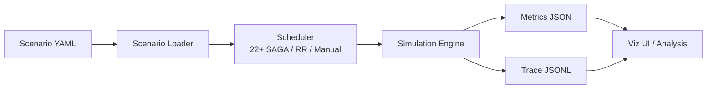

# ncsim Documentation

**ncsim** (Networked Compute Simulator) is a lightweight simulator for DAG
scheduling over heterogeneous networked systems with multi-hop routing and
realistic Wi-Fi interference modeling. It produces detailed JSONL traces and
JSON metrics for analysis.

Developed by the [Autonomous Networks Research Group (ANRG)](https://anrg.usc.edu/) at the University of Southern California.

---

## Key Features

- **Deterministic simulation** -- same inputs plus the same seed produce identical results every time
- **22+ SAGA static batch schedulers** -- HEFT, CPOP, Min-Min, Sufferage, and more from [anrg-saga](https://github.com/ANRGUSC/saga), with optional PEFT plus built-in round-robin and manual assignment
- **Multi-hop routing** -- direct, widest-path (max-min bandwidth), and shortest-path (min-latency) algorithms
- **802.11 WiFi PHY/MAC modeling** -- log-distance path loss, SNR-based MCS rate adaptation for 802.11n/ac/ax
- **Interference models** -- none, proximity, CSMA/CA clique-based, and CSMA/CA Bianchi (dynamic SINR)
- **Fair bandwidth sharing** -- concurrent transfers on the same link share capacity proportionally
- **Web visualization UI** -- interactive experiment builder, Gantt charts, animated replay, and network topology views
- **Structured output** -- JSONL event traces and JSON summary metrics for automated analysis

---

## Guide Roadmap

This documentation is organized into eight sections, each covering a different aspect of ncsim:

| # | Section | What You Will Learn |
|---|---------|---------------------|
| 1 | **[Getting Started](getting-started/installation.md)** | Install ncsim, its dependencies, and the optional visualization frontend |
| 2 | **[Core Concepts](concepts/architecture.md)** | Understand the architecture, simulation model, scheduling, routing, and interference |
| 3 | **[Scenarios](scenarios/yaml-reference.md)** | Write and customize YAML scenario files that define networks, DAGs, and configurations |
| 4 | **[CLI Usage](cli/cli-reference.md)** | Run simulations from the command line, interpret output files, and automate batch experiments |
| 5 | **[Visualization](viz/viz-overview.md)** | Set up and use the web UI to configure experiments and explore results interactively |
| 6 | **[Experiments](experiments/interference-verification.md)** | Reproduce interference verification and routing comparison experiments |
| 7 | **[Tutorials](tutorials/tutorial-1-first-sim.md)** | Follow step-by-step walkthroughs from first simulation to advanced WiFi experiments |
| 8 | **[Reference](reference/faq.md)** | Look up FAQs, troubleshooting tips, and the glossary |

!!! tip "New to ncsim?"
    Start with the [Installation](getting-started/installation.md) guide, then follow the [Quick Start](getting-started/quickstart.md) to run your first simulation in under five minutes.

---

## Quick Links

-   **Installation**

    ---

    Set up Python, clone the repository, and install all dependencies.

    [:octicons-arrow-right-24: Install ncsim](getting-started/installation.md)

-   **Quick Start**

    ---

    Run your first simulation and examine the output in five minutes.

    [:octicons-arrow-right-24: Quick Start guide](getting-started/quickstart.md)

-   **Scenario YAML Reference**

    ---

    Full specification of nodes, links, DAGs, tasks, and config options.

    [:octicons-arrow-right-24: YAML Reference](scenarios/yaml-reference.md)

-   **CLI Reference**

    ---

    All command-line flags, overrides, and usage examples.

    [:octicons-arrow-right-24: CLI Reference](cli/cli-reference.md)

-   **Visualization**

    ---

    Interactive web UI for building scenarios and exploring results.

    [:octicons-arrow-right-24: Viz Overview](viz/viz-overview.md)

-   **Tutorials**

    ---

    Guided walkthroughs from basic to advanced usage.

    [:octicons-arrow-right-24: Tutorial 1](tutorials/tutorial-1-first-sim.md)

---

## How It Works

At a high level, ncsim follows this pipeline:

1. You define a **scenario** in YAML: network topology, node capacities, link bandwidths, DAG task graphs, and configuration (scheduler, routing, interference model, seed).
2. The **scheduler** (powered by anrg-saga) assigns tasks to nodes.
3. The **simulation engine** executes the schedule as a discrete-event simulation, modeling compute time, data transfers, multi-hop routing, bandwidth sharing, and WiFi interference.
4. The engine produces a **JSONL trace** (every event) and **JSON metrics** (summary statistics including makespan, utilization).
5. You can analyze the output with the included `analyze_trace.py` script, feed it into the **web visualization UI**, or process it with your own tools.

---

## Project Information

| | |
|---|---|
| **Repository** | [github.com/ANRGUSC/ncsim](https://github.com/ANRGUSC/ncsim) |
| **PyPI package** | [anrg-ncsim](https://pypi.org/project/anrg-ncsim/) |
| **Paper** | [arXiv:2605.01094](https://arxiv.org/abs/2605.01094) |
| **Software DOI** | [10.5281/zenodo.19138224](https://doi.org/10.5281/zenodo.19138224) |
| **License** | MIT |
| **Python** | 3.12+ |
| **Contributors** | Bhaskar Krishnamachari, Maya Gutierrez |
| **Organization** | [Autonomous Networks Research Group (ANRG)](https://anrg.usc.edu/), University of Southern California |

!!! note "Cite ncsim"
    If you use ncsim in your research, cite the
    [ncsim paper](https://arxiv.org/abs/2605.01094) and the versioned
    [software release](https://doi.org/10.5281/zenodo.19138224). The repository's
    [CITATION.cff](https://github.com/ANRGUSC/ncsim/blob/main/CITATION.cff)
    contains machine-readable citation metadata.
