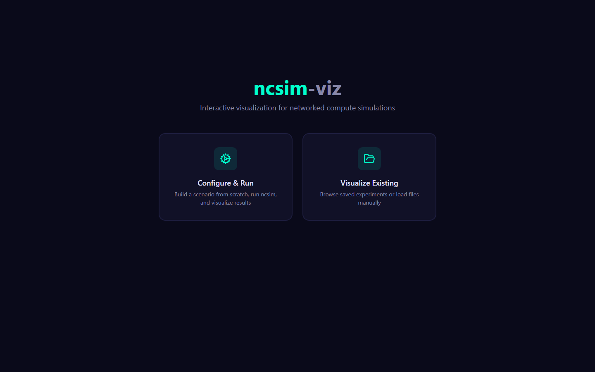
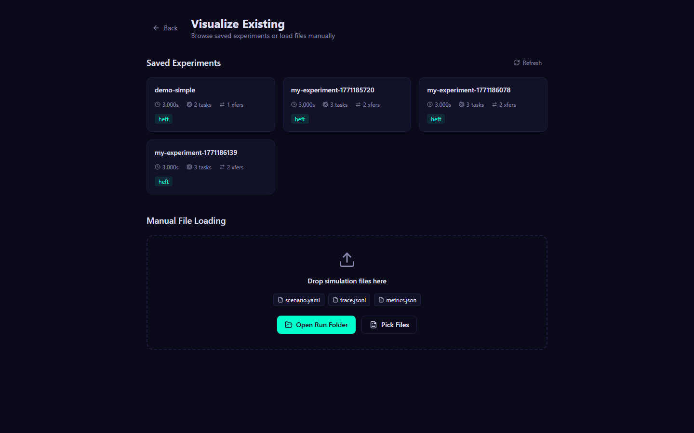

# Tutorial 5: Visualization Walkthrough

A click-by-click tour of every screen in ncsim-viz, from starting the
servers to exploring all six visualization tabs.

---

## What You Will Learn

- Start the viz backend and frontend servers
- Configure and run an experiment through the UI
- Navigate all six visualization tabs
- Load previously saved experiments
- Use keyboard shortcuts for efficient navigation

---

## Prerequisites

| Requirement | Minimum Version | Install Guide |
|---|---|---|
| ncsim | Installed (`pip install -e .`) | [Installation](../getting-started/installation.md) |
| Viz backend | FastAPI + uvicorn | [Viz Setup](../viz/setup.md) |
| Viz frontend | Node.js 18+, npm packages installed | [Viz Setup](../viz/setup.md) |

!!! warning "Both servers required"
    The "Configure & Run" workflow requires both the backend (port 8000)
    and frontend (port 5173) to be running. The "Visualize Existing"
    workflow also needs the backend to list saved experiments.

---

## Step 1: Start the Servers

Open two terminal windows and start the backend and frontend servers.

=== "Terminal 1 -- Backend"

    ```bash
    cd viz/server
    python run.py
    ```

    Wait for the message:

    ```
    INFO:     Uvicorn running on http://127.0.0.1:8000 (Press CTRL+C to quit)
    ```

=== "Terminal 2 -- Frontend"

    ```bash
    cd viz
    npm run dev
    ```

    Wait for the message:

    ```
    VITE v7.x.x  ready in XXX ms

      Local:   http://localhost:5173/
    ```

Open **http://localhost:5173** in your browser.

---

## Step 2: Home Page



The home page presents two workflow cards:

| Card | Description | Requirements |
|---|---|---|
| **Configure & Run** | Build a scenario from scratch using the form editor, run it on the backend, and visualize the results | Backend + Frontend |
| **Visualize Existing** | Browse saved experiments from the `sample-runs/` directory and load their results | Backend + Frontend |

Click **"Configure & Run"** to proceed.

---

## Step 3: Configure an Experiment


The configuration form has several sections. Start by setting the basic
parameters at the top:

| Field | Value | Notes |
|---|---|---|
| Experiment name | `my-first-viz-run` | Used as the output directory name |
| Scheduler | HEFT | Best general-purpose choice |
| Routing | Direct | Single-hop routing |
| Seed | 42 | For reproducibility |

!!! tip "All fields have defaults"
    The form is pre-populated with sensible defaults. You only need to
    change the fields you want to customize.

---

## Step 4: Choose a Topology


The Topology section lets you define network nodes and links. Select the
**"Star"** preset with 5 nodes. The UI generates:

- A central hub node with the highest compute capacity
- Four leaf nodes connected to the hub
- Bidirectional links between each leaf and the hub

The node table and link table are auto-populated. You can edit individual
cells to customize compute capacities, bandwidths, or latencies.

!!! info "Topology presets"
    Available presets include Star, Line, Ring, Mesh, and Custom. Each
    preset generates a different network structure with editable
    parameters.

---

## Step 5: Design the DAG


The DAG section defines the task dependency graph. Select the
**"Fork-Join"** preset with 6 tasks. This creates:

- One root task that fans out to 4 parallel worker tasks
- One sink task that collects results from all workers
- Edges with configurable data sizes between each pair

Review the task table (IDs, compute costs) and the edge table (source,
destination, data sizes). Edit any values as needed.

---

## Step 6: Set Interference


The Interference section controls the wireless interference model.
Select **"Proximity"** from the dropdown and set the radius to **15.0**
meters.

| Interference Model | When to Use |
|---|---|
| None | Wired networks or no contention |
| Proximity | Quick approximation of spectrum contention |
| CSMA Clique | WiFi-aware static bandwidth reduction |
| CSMA Bianchi | Most realistic dynamic WiFi model |

!!! note "Proximity is the default"
    The proximity model is a good starting point. It reduces effective
    bandwidth when active links are within the specified radius. For
    realistic WiFi behavior, switch to CSMA Bianchi.

---

## Step 7: Preview and Run


Before running, click the YAML preview to review the auto-generated
scenario file. This shows the exact YAML that will be sent to the
backend. Verify that all settings look correct.

When satisfied, click **"Run Experiment"**.


The backend receives the YAML, invokes `ncsim` as a subprocess, and
returns the results. This typically completes in 1--2 seconds.

!!! warning "Backend must be running"
    If you see a "Network Error" message, confirm that the backend
    server is running on port 8000. Check Terminal 1 for any error
    messages.

---

## Step 8: Explore the Overview Tab


After the simulation completes, you are taken to the results page. The
**Overview** tab (keyboard shortcut: ++1++) displays a dashboard with:

| Metric | Description |
|---|---|
| Makespan | Total simulation time from first task start to last task completion |
| Total Tasks | Number of tasks across all DAGs |
| Total Transfers | Number of data transfers between tasks |
| Node Utilization | Per-node bar chart showing fraction of makespan spent computing |
| Link Utilization | Per-link bar chart showing fraction of makespan spent transferring |

---

## Step 9: Examine the Network


Switch to the **Network** tab (keyboard shortcut: ++2++). This shows an
interactive D3 force-directed graph of the network topology.

**Interactions:**

- **Drag** nodes to rearrange the layout
- **Scroll** to zoom in and out
- **Click** a node to see its details (ID, compute capacity, position)
- **Click** a link to see its properties (bandwidth, latency)

Nodes are sized proportionally to their compute capacity. Links are
labeled with bandwidth values.

---

## Step 10: View the DAG


Switch to the **DAG** tab (keyboard shortcut: ++3++). This shows the
task dependency graph using a hierarchical Dagre layout.

- Tasks are **colored by their assigned node** -- tasks on the same
  node share the same color
- Edges show **data sizes** in MB
- The layout flows top-to-bottom, with entry tasks at the top and exit
  tasks at the bottom

Click any task to see its details: compute cost, assigned node, start
time, and completion time.

---

## Step 11: Read the Schedule


Switch to the **Schedule** tab (keyboard shortcut: ++4++). This displays
a static Gantt chart showing the complete execution timeline.

| Element | Representation |
|---|---|
| Task execution | Solid colored bar on the assigned node's row |
| Data transfer | Hatched bar on the link's row |
| Idle time | Empty space between bars |

The horizontal axis is simulation time in seconds. The vertical axis
groups events by node and link. Hover over any bar to see detailed
timing information.

---

## Step 12: Watch the Simulation


Switch to the **Simulation** tab (keyboard shortcut: ++5++). This is the
animated event replay -- the most interactive visualization.

**Playback controls:**

| Control | Action |
|---|---|
| ++space++ | Play / Pause |
| ++arrow-right++ | Step forward one event |
| ++arrow-left++ | Step backward one event |
| ++plus++ | Increase playback speed |
| ++minus++ | Decrease playback speed |
| ++home++ | Jump to beginning |
| ++end++ | Jump to end |

The simulation view combines three synchronized panels:

1. **Network overlay** -- nodes and links light up as tasks execute and
   data transfers occur
2. **Growing Gantt chart** -- the schedule builds up in real time as
   events are replayed
3. **Event log** -- a scrolling list of events with timestamps and
   details

---

## Step 13: Check Parameters


Switch to the **Parameters** tab (keyboard shortcut: ++6++). This is a
read-only inspector showing the complete experiment configuration:

- Scheduler, routing, and interference settings
- Full network definition (nodes, links, positions)
- DAG structure (tasks, edges, data sizes)
- RF parameters (if WiFi models are active)
- Seed and other simulation options

!!! tip "Debugging unexpected results"
    If a simulation produces unexpected results, check the Parameters
    tab first. It shows the exact configuration that was used, including
    any defaults that were applied.

---

## Step 14: Browse Saved Experiments

Navigate back to the home page and click **"Visualize Existing"**.



The experiment browser lists all saved experiments from the
`viz/public/sample-runs/` directory. Each entry shows:

- Experiment name
- Scenario name
- Scheduler used
- Makespan result

Click any experiment to load it instantly. The same six visualization
tabs become available with the loaded data.

!!! info "Adding your own experiments"
    To add a CLI-generated experiment to the browser, copy its output
    directory into `viz/public/sample-runs/`:

    ```bash
    cp -r results/my_run viz/public/sample-runs/my_run
    ```

    Refresh the browser to see it in the list.

---

## Keyboard Shortcuts Reference

| Shortcut | Action |
|---|---|
| ++1++ through ++6++ | Switch between visualization tabs |
| ++space++ | Play / Pause simulation playback |
| ++arrow-right++ | Step forward one event |
| ++arrow-left++ | Step backward one event |
| ++plus++ | Increase playback speed |
| ++minus++ | Decrease playback speed |
| ++home++ | Jump to beginning of simulation |
| ++end++ | Jump to end of simulation |
| ++question++ | Show keyboard shortcuts help |

---

## Summary

You have now explored every feature of ncsim-viz:

1. **Home Page** -- Choose between Configure & Run or Visualize Existing
2. **Configuration Form** -- Build scenarios with topology, DAG, and
   interference settings
3. **Overview Tab** -- Dashboard metrics and utilization bars
4. **Network Tab** -- Interactive force-directed topology graph
5. **DAG Tab** -- Hierarchical task dependency visualization
6. **Schedule Tab** -- Static Gantt chart of the full execution timeline
7. **Simulation Tab** -- Animated event replay with synchronized views
8. **Parameters Tab** -- Read-only configuration inspector
9. **Experiment Browser** -- Load and compare saved experiments

---

## Next Steps

- **[Viz Setup](../viz/setup.md)** -- Installation details for the viz
  platform
- **[Visualization Tabs](../viz/visualization-tabs.md)** -- Detailed
  reference for each tab
- **[Keyboard Shortcuts](../viz/keyboard-shortcuts.md)** -- Complete
  shortcut reference
- **[Tutorial 4: Compare Schedulers](tutorial-4-compare-schedulers.md)**
  -- Generate results to visualize
