# Tutorial 5: Visualization Walkthrough

A click-by-click tour of the Ncsim 1.1.0 visualization UI, including the full
SAGA 2.1 scheduler catalog, RF-derived link rates, experiment execution, and all
six result tabs.

All screenshots in this tutorial were captured from the current visualization UI
in light mode at 1440 x 900 with SAGA 2.1.0 installed.

---

## What You Will Learn

- Start the visualization backend and frontend
- Select any installed SAGA scheduler and set supported constructor options
- Configure topology, DAG, routing, interference, and RF-derived link rates
- Run an experiment from the browser
- Explore all six result tabs
- Browse saved runs or load result files manually
- Use the visualization keyboard shortcuts

## Prerequisites

| Requirement | Version / Command |
|---|---|
| Ncsim | Install from the repository with `pip install -e .` |
| SAGA | 2.1.0 tagged source release for the 23-algorithm catalog |
| Backend | Python 3.12+, FastAPI, and Uvicorn |
| Frontend | Node.js 18+ and `npm install` in `viz/` |

Install the visualization dependencies from the repository root:

```bash
pip install -e .
python -m pip install "anrg-saga @ git+https://github.com/ANRGUSC/saga.git@v2.1.0"
pip install -r viz/server/requirements.txt
cd viz
npm install
cd ..
```

---

## Step 1: Start Ncsim-Viz

### GitHub Codespaces

The current repository includes a `start-viz` helper. From the repository root:

```bash
start-viz
```

Open the forwarded Ncsim visualization URL shown by Codespaces.

### Local Development

Use two terminals.

=== "Terminal 1 -- Backend"

    ```bash
    cd viz/server
    python run.py
    ```

    The API listens on `http://127.0.0.1:8000`.

=== "Terminal 2 -- Frontend"

    ```bash
    cd viz
    npm run dev
    ```

    Open `http://localhost:5173`.

Both servers are required for **Configure & Run** and for the saved-experiment
browser. Manual file loading can render results in the frontend without invoking
the simulation API.

---

## Step 2: Choose a Workflow

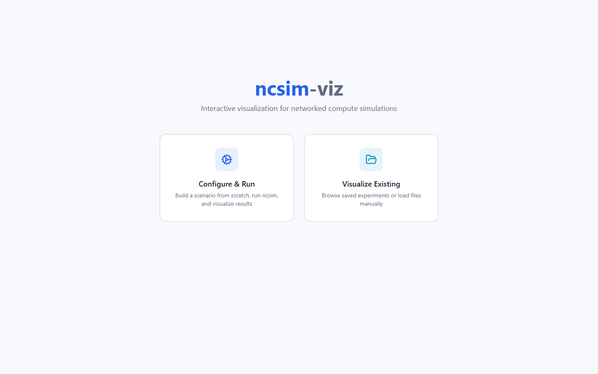

The home page offers two workflows:

| Workflow | Purpose |
|---|---|
| **Configure & Run** | Build a scenario, execute Ncsim through the backend, and open the results immediately |
| **Visualize Existing** | Browse saved runs or load `scenario.yaml`, `trace.jsonl`, and `metrics.json` from disk |

Click **Configure & Run**.

---

## Step 3: Set the Basic Configuration

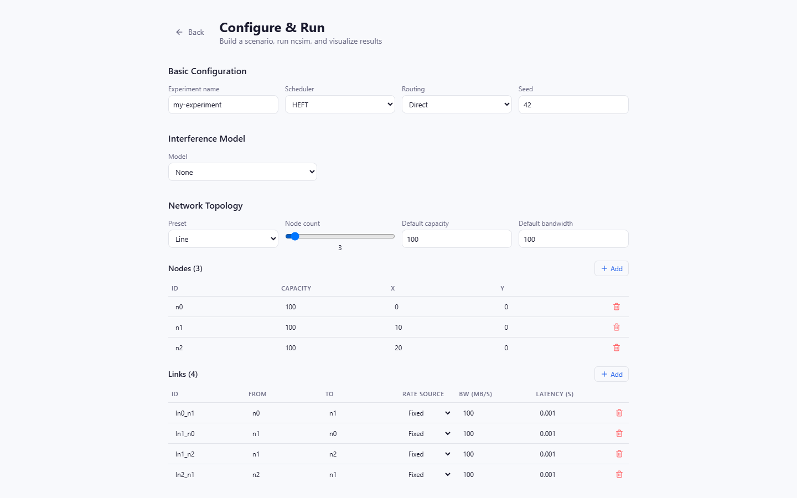

The form starts with these defaults:

| Field | Default | Meaning |
|---|---|---|
| Experiment name | `my-experiment` | Slug used for the saved run directory |
| Scheduler | HEFT | Task-to-node placement algorithm |
| Routing | Direct | Route model used for inter-node transfers |
| Seed | 42 | Reproducibility seed |
| Interference | None | No inter-link interference adjustment |

The scheduler selector is populated by the backend's `/api/schedulers` endpoint.
With SAGA 2.1 installed, it contains 23 SAGA algorithms plus the built-in
**Round Robin** and **Manual** choices.

If SAGA 2.0.4 is installed instead, the selector contains 22 SAGA algorithms and
omits PEFT; the UI always reflects the backend's installed scheduler catalog.

### Scheduler Options

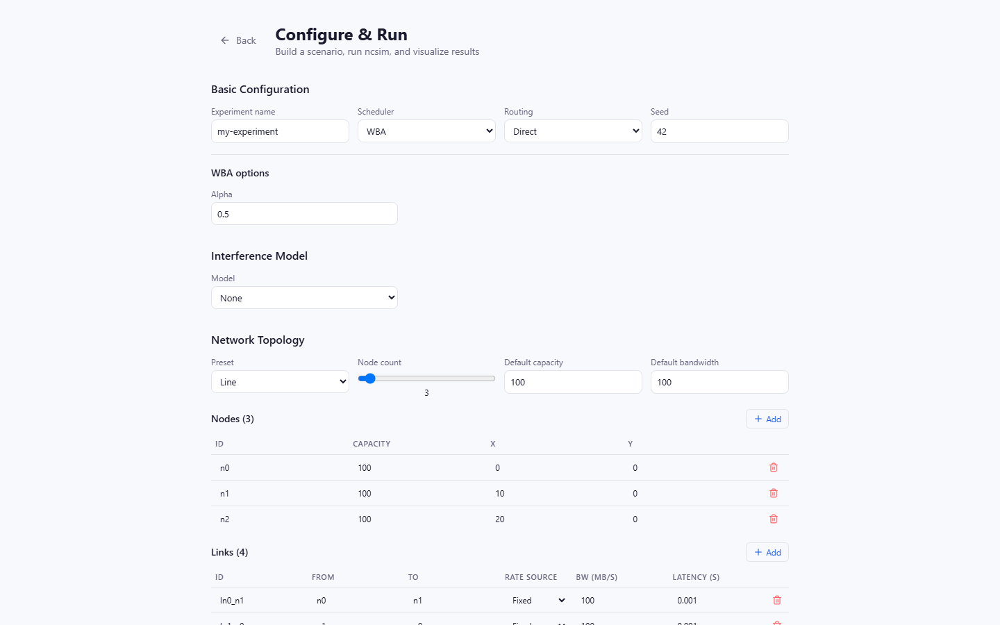

When a scheduler exposes constructor settings, typed controls appear below the
selector:

| Scheduler | UI Option |
|---|---|
| FCP | Priority queue size |
| GDL | Dynamic level (`1` or `2`) |
| SMT | Epsilon and optional solver name |
| WBA | Alpha (`0` to `1`) |

The generated YAML stores these values in `config.scheduler_options`. Select
**HEFT** again before continuing.

---

## Step 4: Build a Network Topology

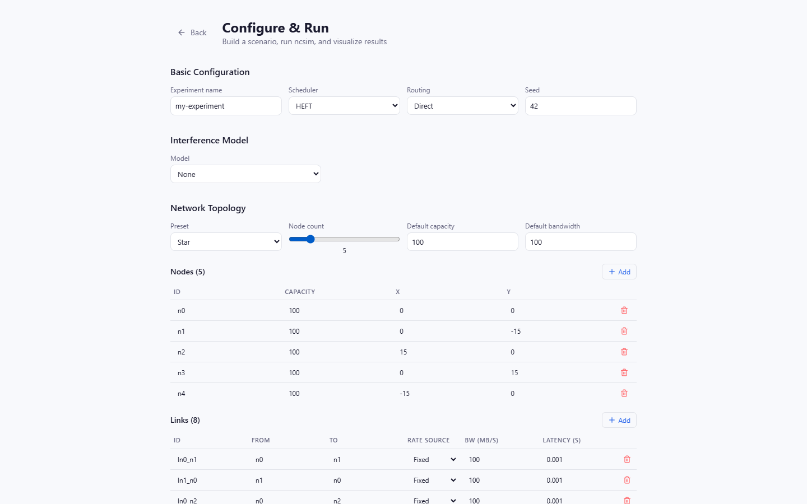

Select the **Star** preset and set **Node count** to `5`. Current topology
presets are:

- Line
- Ring
- Star
- Mesh (fully connected)
- Grid
- Random (radio-range)
- Custom

Every generated node and link remains editable. The random preset uses the seed
and RF configuration to place nodes and connect pairs within radio range.

Each link has a **Rate source**:

| Rate Source | Behavior |
|---|---|
| Fixed | Use the explicit bandwidth value in MB/s |
| Auto (default) | Omit bandwidth and let the non-WiFi path use Ncsim's default |
| Auto (RF) | With `csma_clique` or `csma_bianchi`, omit bandwidth so Ncsim derives the PHY rate from distance and RF settings |

---

## Step 5: Build a DAG

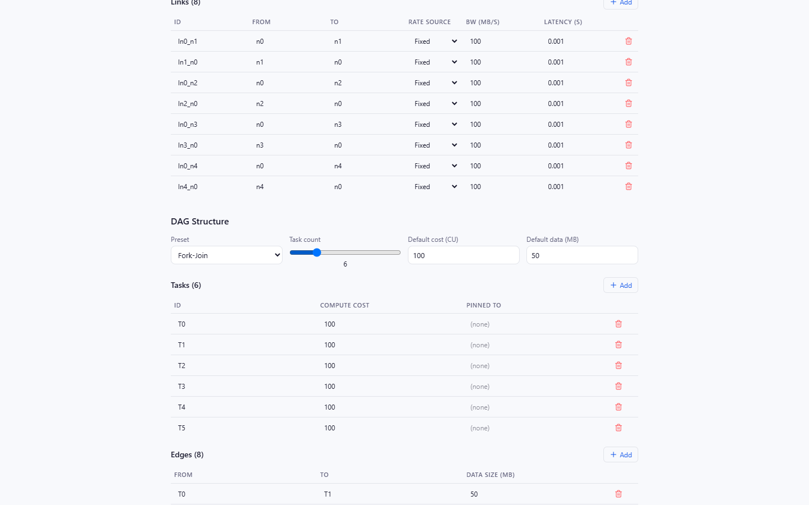

Select **Fork-Join** and set **Task count** to `6`. The preset creates a source,
four parallel workers, and a sink. Other presets are Chain, Diamond, Parallel,
and Custom.

You can edit task IDs, compute costs, optional `pinned_to` assignments, edge
endpoints, and data sizes. When the **Manual** scheduler is selected, `Pinned To`
becomes a node dropdown; assign every task before running.

---

## Step 6: Configure WiFi Interference

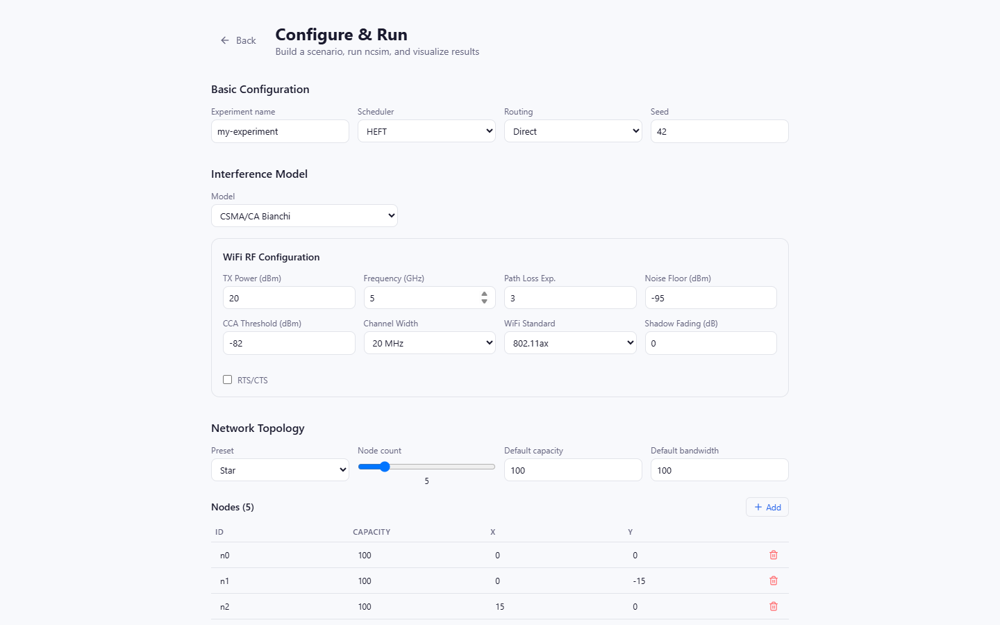

Select **CSMA/CA Bianchi**. The RF panel exposes:

- TX power and carrier frequency
- Path-loss exponent and noise floor
- CCA threshold and channel width
- WiFi standard (`802.11n`, `802.11ac`, or `802.11ax`)
- Shadow-fading sigma
- RTS/CTS

The four interference choices are:

| Model | Use |
|---|---|
| None | No inter-link interference model |
| Proximity | Fast radius-based bandwidth sharing approximation |
| CSMA/CA Clique | Static PHY-rate division by maximum conflict clique |
| CSMA/CA Bianchi | Dynamic WiFi contention with MAC efficiency and SINR effects |

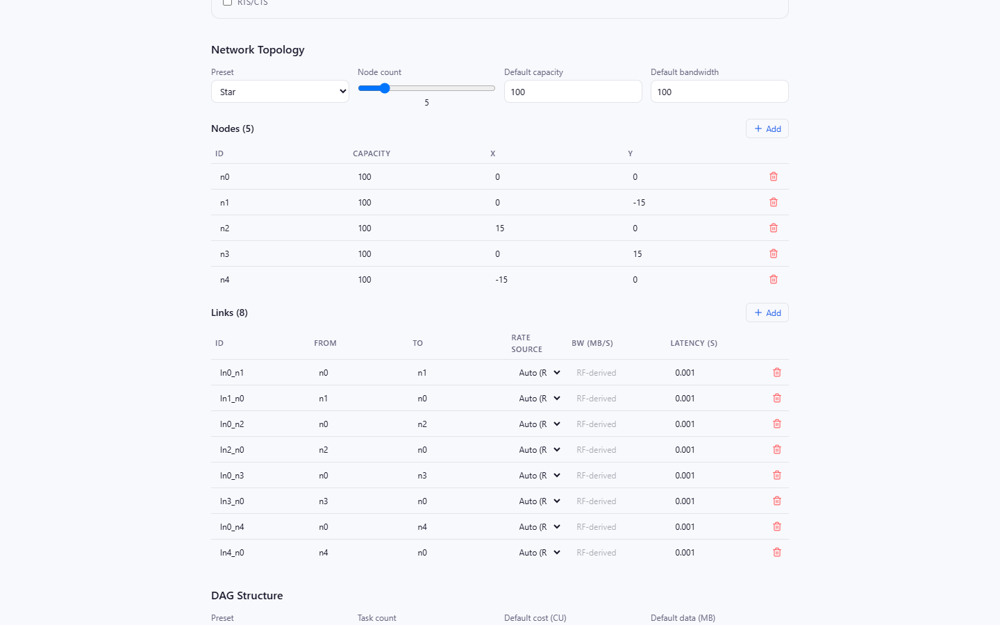

After selecting a WiFi model, choose **Auto (RF)** for links whose bandwidth
should be derived from their node positions and the RF panel. Fixed links retain
their entered bandwidth and are not overwritten in the generated YAML.

---

## Step 7: Preview and Run


The YAML preview is live. Confirm that it contains:

- The scheduler and any `scheduler_options`
- Routing, seed, and interference model
- RF settings when a WiFi model is active
- Nodes, links, and fixed or omitted bandwidth fields
- Tasks, edges, and `pinned_to` values

Click **Run Experiment**.

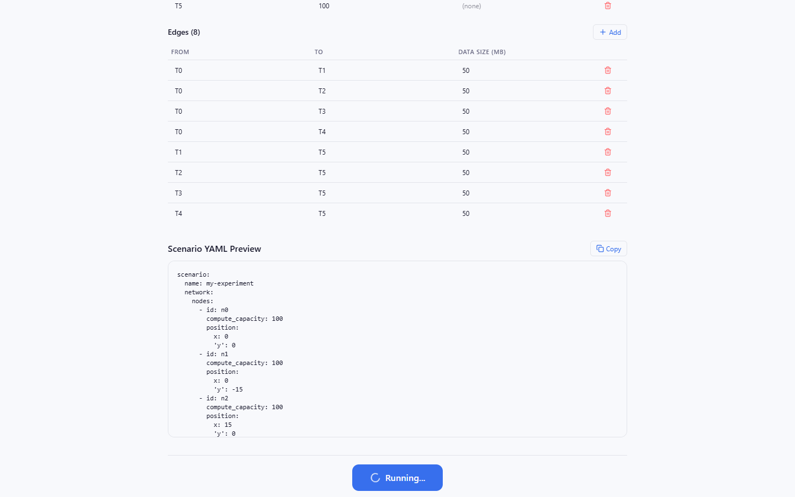

The backend writes the YAML to a temporary file, invokes the current Ncsim
package, and saves the completed run under `viz/public/sample-runs/`. The UI then
loads the returned scenario, trace, and metrics.

If the request fails, verify that port 8000 is serving the Ncsim FastAPI backend
and inspect its terminal for a validation or scheduler error.

---

## Step 8: Read the Overview

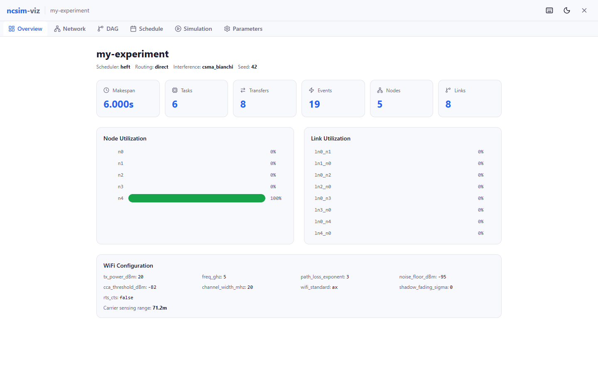

The **Overview** tab (`1`) summarizes:

- Makespan
- Task and transfer counts
- Node utilization
- Link utilization
- WiFi settings and derived rates when present

Utilization is normalized by makespan, making idle resources and hot spots easy
to compare.

---

## Step 9: Inspect the Network

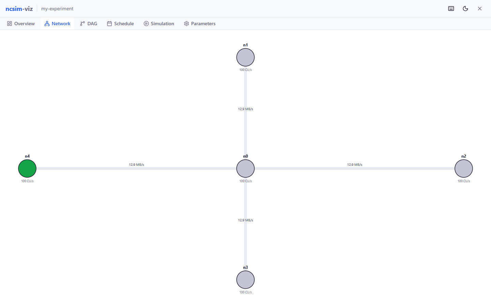

The **Network** tab (`2`) renders an interactive D3 topology.

- Drag nodes to reposition them
- Scroll to zoom and pan the SVG view
- Hover nodes for ID, compute capacity, and position
- Read link bandwidth and latency labels

Nodes are sized by compute capacity. In the simulation tab, active tasks and
transfers use the same network layout.

---

## Step 10: Inspect the DAG

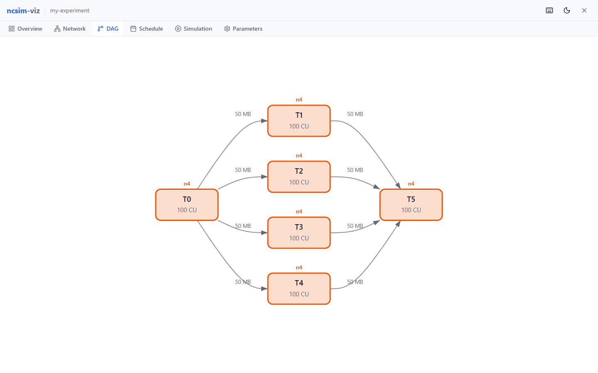

The **DAG** tab (`3`) uses a hierarchical Dagre layout. Tasks are colored by
their assigned compute node, while edges show dependency data sizes. Zoom or pan
the graph and hover a task for its assignment and timing details.

---

## Step 11: Read the Schedule

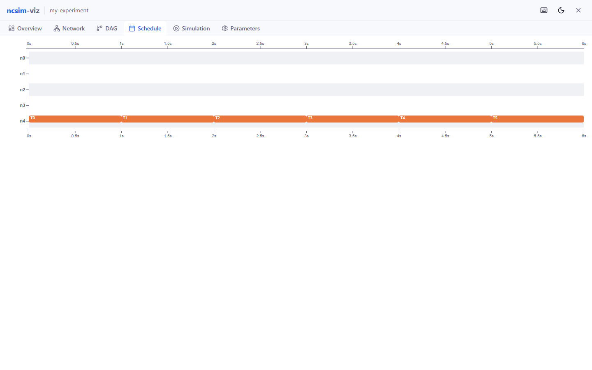

The **Schedule** tab (`4`) shows the complete execution timeline:

| Mark | Meaning |
|---|---|
| Solid task bar | Compute execution on a node |
| Transfer bar | Data movement on a link |
| Empty interval | Idle time |

Hover a bar for exact start, end, and duration values.

---

## Step 12: Replay the Simulation

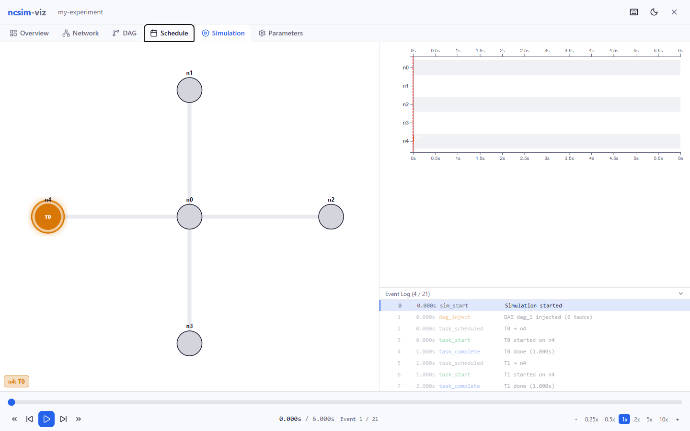

The **Simulation** tab (`5`) synchronizes three views:

1. Network activity
2. A growing Gantt timeline
3. A clickable event log

Use the playback controls or keyboard:

| Shortcut | Action |
|---|---|
| `Space` | Play or pause |
| `Left` / `Right` | Step one event backward or forward |
| `Shift+Left` / `Shift+Right` | Jump 10% of the makespan |
| `Home` / `End` | Jump to the beginning or end |
| `+` / `-` | Increase or decrease speed |

Clicking an event jumps directly to its simulation time.

---

## Step 13: Verify the Parameters

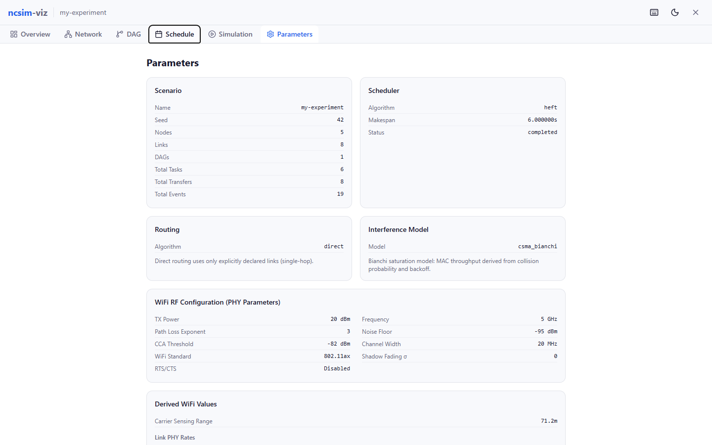

The **Parameters** tab (`6`) is the first place to check when a result is
surprising. It displays the scenario configuration, scheduler and routing,
network, DAG, task assignments, interference model, and RF values used by the
completed run.

---

## Step 14: Browse or Load Existing Runs

Close the result view and select **Visualize Existing**.

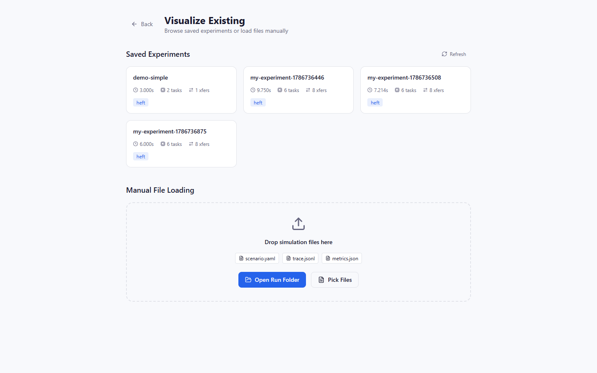

The browser lists directories under `viz/public/sample-runs/` and shows available
makespan, task count, transfer count, and scheduler metadata. Click a card to open
the run.

You can also:

- Drop `scenario.yaml`, `trace.jsonl`, and `metrics.json` together
- Choose **Open Run Folder**
- Pick the three files individually

To expose a CLI-generated run in the saved-experiment browser:

```bash
cp -r results/my_run viz/public/sample-runs/my_run
```

Then click **Refresh**.

---

## Keyboard Shortcuts

| Shortcut | Action |
|---|---|
| `1` through `6` | Switch result tabs |
| `D` | Toggle dark or light mode |
| `?` | Open shortcut help |
| `Space` | Play or pause simulation replay |
| `Left` / `Right` | Step one replay event |
| `Shift+Left` / `Shift+Right` | Jump 10% |
| `Home` / `End` | Jump to start or end |
| `+` / `-` | Change playback speed |

---

## Summary

You have used the current Ncsim visualization workflow end to end:

1. Started the API and frontend
2. Loaded the installed 23-algorithm SAGA scheduler catalog
3. Configured scheduler options, topology, DAG, routing, and interference
4. Used fixed and RF-derived link rates
5. Ran and saved an experiment
6. Explored Overview, Network, DAG, Schedule, Simulation, and Parameters
7. Browsed or manually loaded completed runs

## Next Steps

- **[Tutorial 3: WiFi Experiment](tutorial-3-wifi-experiment.md)** -- validate
  RF and interference behavior from the CLI
- **[Tutorial 4: Compare Schedulers](tutorial-4-compare-schedulers.md)** -- run
  representative SAGA scheduler comparisons
- **[Visualization Tabs](../viz/visualization-tabs.md)** -- detailed tab reference
- **[Keyboard Shortcuts](../viz/keyboard-shortcuts.md)** -- shortcut reference
