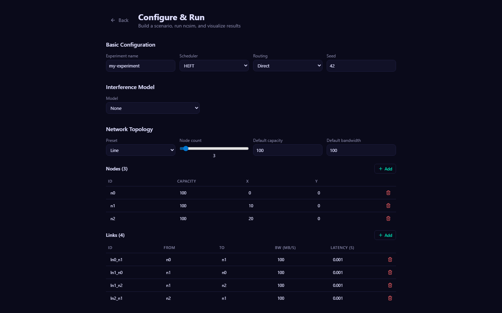
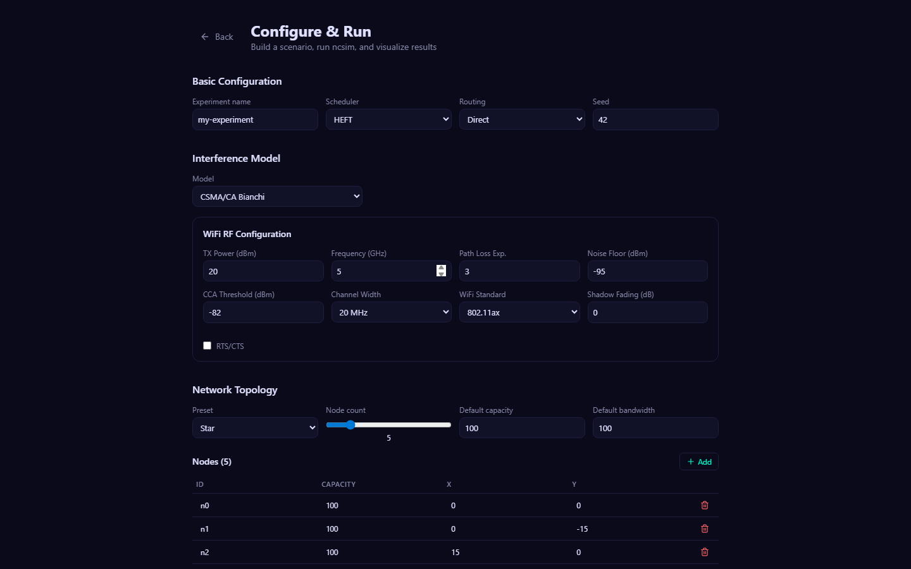
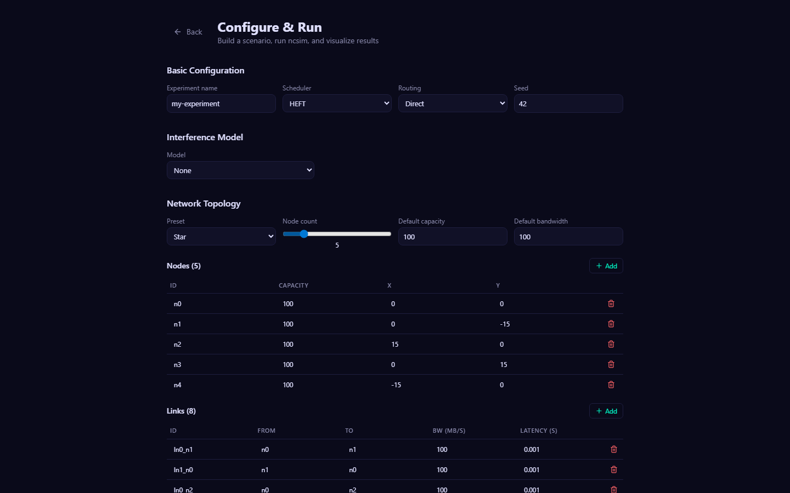
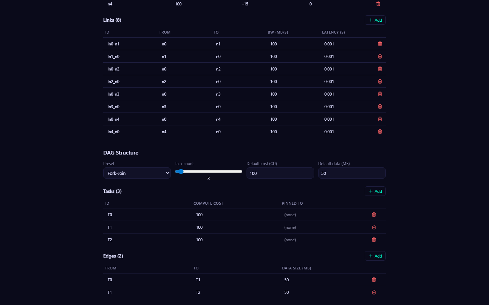
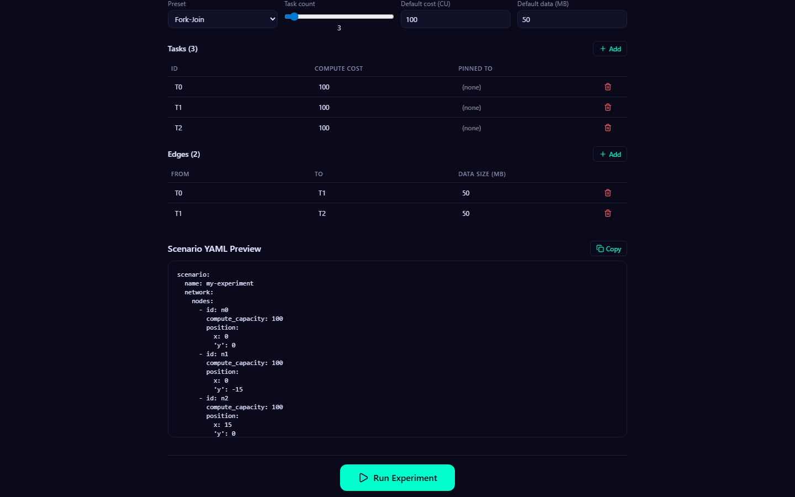
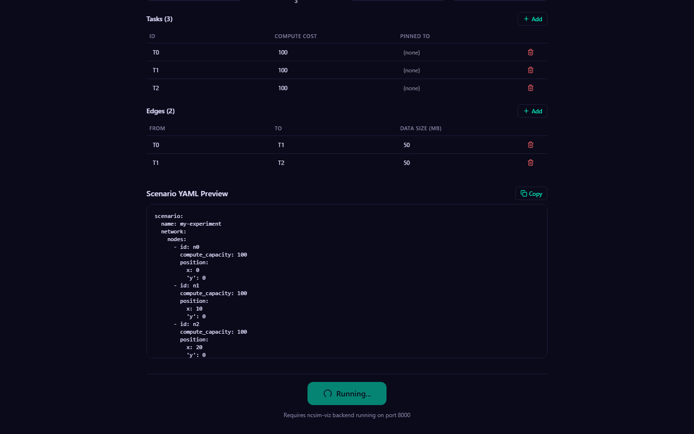

# Configure & Run

The Configure & Run workflow lets you build a scenario interactively, submit it to the backend, and visualize results immediately. This page provides a full walkthrough of the configuration form.

---

## Basic Configuration



The top section of the form contains four fields that control the core simulation parameters.

| Field | Type | Default | Description |
|---|---|---|---|
| Experiment name | text | `my-experiment` | Identifies this run. Used as the directory name for saved results. |
| Scheduler | select | `heft` | Task scheduling algorithm. See options below. |
| Routing | select | `direct` | Routing mode for data transfers between nodes. |
| Seed | number | `42` | Random seed for deterministic reproducibility. |

### Scheduler Options

| Value | Algorithm | Description |
|---|---|---|
| `heft` | HEFT | Heterogeneous Earliest Finish Time -- prioritizes tasks by upward rank, assigns each to the node that gives the earliest finish |
| `cpop` | CPOP | Critical Path on a Processor -- identifies the critical path and schedules critical tasks on the fastest processor |
| `round_robin` | Round Robin | Assigns tasks to nodes in a round-robin rotation |
| `manual` | Manual | You assign each task to a specific node using the "Pinned To" column in the DAG section |

### Routing Options

| Value | Algorithm | Description |
|---|---|---|
| `direct` | Direct | Uses only explicitly declared links (single-hop). Fails if no direct link exists. |
| `widest_path` | Widest Path | Finds the multi-hop path that maximizes bottleneck bandwidth. |
| `shortest_path` | Shortest Path | Finds the multi-hop path that minimizes total latency (hop count). |

!!! tip "Manual scheduler"
    When you select the **manual** scheduler, the "Pinned To" column in the DAG Structure section switches from a free-text input to a dropdown populated with all defined node IDs, making it easy to assign each task to a specific node.

---

## Interference Model



The Interference Model section lets you select how concurrent wireless transmissions affect each other. The form dynamically shows or hides fields based on your selection.

### Available Models

| Model | Behavior | Extra Fields Shown |
|---|---|---|
| None | No interference. Links use their declared bandwidth at all times. | -- |
| Proximity | Links within a configurable radius of each other share bandwidth. | Radius (m) |
| CSMA/CA Clique | Static clique-based model. Link bandwidth = PHY rate / max clique size. | WiFi RF Configuration panel |
| CSMA/CA Bianchi | Bianchi saturation throughput model. MAC throughput derived from collision probability and backoff parameters. | WiFi RF Configuration panel |

### WiFi RF Configuration

When you select either CSMA/CA model, a dedicated panel appears with the following PHY-layer parameters:

| Field | Default | Description |
|---|---|---|
| TX Power (dBm) | 20 | Transmit power |
| Frequency (GHz) | 5.0 | Carrier frequency |
| Path Loss Exponent | 3.0 | Log-distance path loss exponent |
| Noise Floor (dBm) | -95 | Receiver noise floor |
| CCA Threshold (dBm) | -82 | Clear Channel Assessment threshold |
| Channel Width | 20 MHz | Channel bandwidth (20, 40, 80, or 160 MHz) |
| WiFi Standard | 802.11ax | Standard for MCS rate table (802.11n, 802.11ac, or 802.11ax) |
| Shadow Fading (dB) | 0 | Standard deviation of log-normal shadow fading |
| RTS/CTS | Off | Enable Request-to-Send / Clear-to-Send handshake |

!!! note "RF parameters affect topology generation"
    When the topology preset is set to "Random (radio-range)", the RF parameters (TX power, frequency, path loss exponent, noise floor) determine the radio range. Links are automatically generated between nodes that fall within this computed range. Changing RF parameters will regenerate the random topology.

---

## Network Topology



The Network Topology section defines the compute nodes and communication links of the network.

### Topology Presets

Select a preset to auto-generate a topology, or choose Custom to define nodes and links manually.

| Preset | Shape | Link Pattern |
|---|---|---|
| Line | Chain | n-1 sequential links connecting nodes in order |
| Ring | Closed loop | n links forming a cycle |
| Star | Hub-and-spoke | n-1 links from a central hub to all other nodes |
| Mesh (fully connected) | Complete graph | n(n-1)/2 links connecting every pair of nodes |
| Grid | 2D grid | Horizontal and vertical links in a grid pattern |
| Random (radio-range) | Position-based | Links created between nodes within the computed radio range |
| Custom | Manual | No auto-generation; define nodes and links by hand |

### Topology Parameters

| Parameter | Range | Description |
|---|---|---|
| Node count | 2 -- 20 | Number of compute nodes (slider) |
| Default capacity | 1+ | Default compute capacity (CU/s) for generated nodes |
| Default bandwidth | 0.1+ | Default bandwidth (MB/s) for generated links |

### Nodes Table

Each node has the following editable fields:

| Column | Description |
|---|---|
| ID | Unique node identifier (e.g., `n0`, `n1`) |
| Capacity | Compute capacity in CU/s |
| X | X-coordinate position |
| Y | Y-coordinate position |

You can add nodes with the **Add** button or remove individual nodes with the trash icon. When using a preset other than Custom, editing the table switches the mode to Custom.

### Links Table

Each link has the following editable fields:

| Column | Description |
|---|---|
| ID | Unique link identifier (e.g., `l0`, `l1`) |
| From | Source node ID |
| To | Target node ID |
| BW (MB/s) | Bandwidth in megabytes per second |
| Latency (s) | Propagation latency in seconds |

---

## DAG Structure



The DAG Structure section defines the task dependency graph that the scheduler will map onto the network.

### DAG Presets

| Preset | Shape | Description |
|---|---|---|
| Chain | Sequential | Each task depends on the previous one, forming a linear chain |
| Fork-Join | Fan-out / fan-in | A root task fans out to parallel workers, which all converge to a sink task |
| Diamond | Two-level | Root fans to parallel middle layer, which merges, then fans again to a second layer before the final sink |
| Parallel (independent) | Independent | All tasks are independent with no data dependencies |
| Custom | Manual | No auto-generation; define tasks and edges by hand |

### DAG Parameters

| Parameter | Range | Description |
|---|---|---|
| Task count | 2 -- 20 | Number of tasks (slider) |
| Default cost (CU) | 1+ | Default compute cost in compute units for generated tasks |
| Default data (MB) | 0.1+ | Default data size in megabytes for generated edges |

### Tasks Table

| Column | Description |
|---|---|
| ID | Unique task identifier (e.g., `T0`, `T1`) |
| Compute Cost | Compute cost in CU (compute units) |
| Pinned To | Optional: force this task onto a specific node (used with manual scheduler, or to override any scheduler) |

### Edges Table

| Column | Description |
|---|---|
| From | Source task ID (producer) |
| To | Target task ID (consumer) |
| Data Size (MB) | Volume of data transferred between tasks |

---

## YAML Preview



At the bottom of the form, a live YAML preview shows the complete scenario definition that will be sent to the backend. This YAML updates in real time as you modify any form field.

The preview includes:

- Scenario name
- Full network definition (nodes with positions and capacities, links with bandwidths and latencies)
- DAG definition (tasks with compute costs, edges with data sizes)
- Config section (scheduler, seed, routing, interference model, and RF parameters if applicable)

!!! tip "Reusable scenarios"
    Click the **Copy** button to copy the YAML to your clipboard. You can save it as a `.yaml` file and reuse it with the ncsim CLI:

    ```bash
    python -m ncsim --scenario my-scenario.yaml --output results/
    ```

---

## Running the Experiment



Click the **Run Experiment** button at the bottom of the form to submit the scenario to the backend.

The backend performs the following steps:

1. Writes the scenario YAML to a temporary directory
2. Invokes ncsim as a subprocess with `--scenario` and `--output` flags
3. Reads the generated `trace.jsonl` and `metrics.json` files
4. Returns all three files (scenario YAML, trace JSONL, metrics JSON) to the frontend
5. Saves the results in `viz/public/sample-runs/` for future browsing

!!! info "Execution time"
    Simple scenarios (a few nodes and tasks, no interference) complete in under 2 seconds. Complex WiFi scenarios with CSMA/CA Bianchi interference may take longer. The backend enforces a 60-second timeout.

After the run completes successfully, the UI automatically transitions to the visualization view, starting on the Overview tab. If the run fails, an error message is displayed below the Run button with details from ncsim's stderr output.

!!! warning "Backend required"
    The Run Experiment button requires the FastAPI backend to be running on port 8000. If the backend is not available, the button will show an error. See [Viz Setup](setup.md) for instructions on starting both servers.

---

## Next Steps

- **[Visualization Tabs](visualization-tabs.md)** -- Explore the results across all six tabs
- **[Keyboard Shortcuts](keyboard-shortcuts.md)** -- Navigate the UI efficiently
