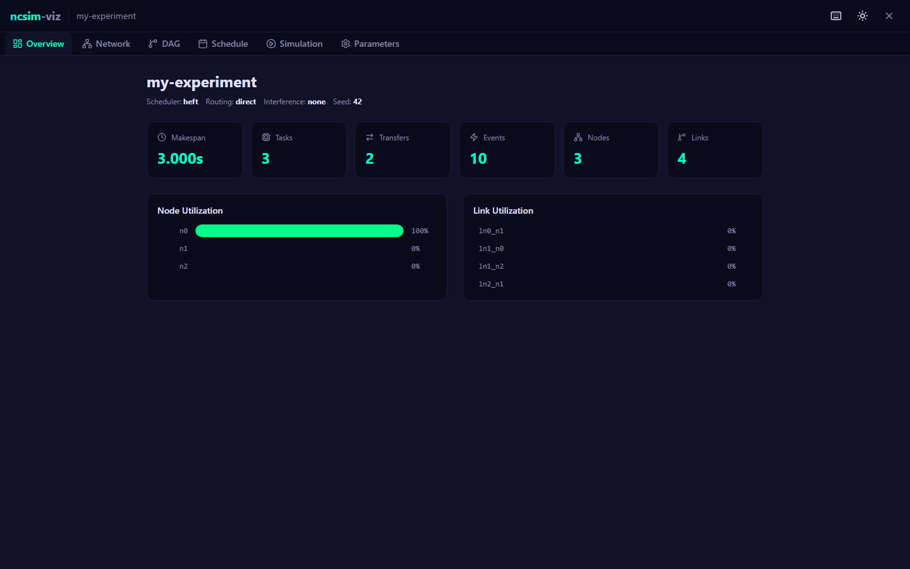
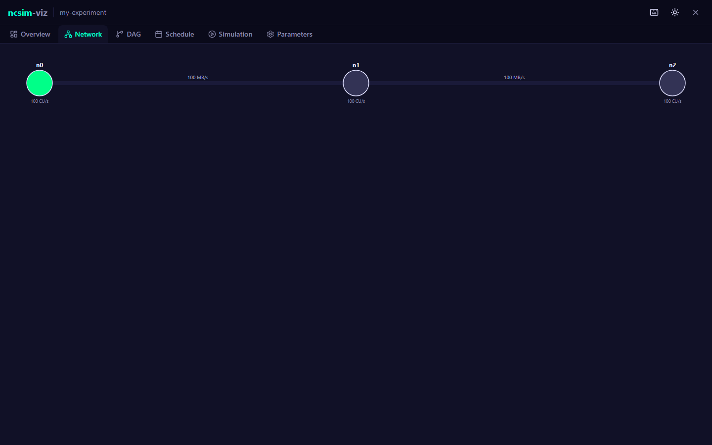
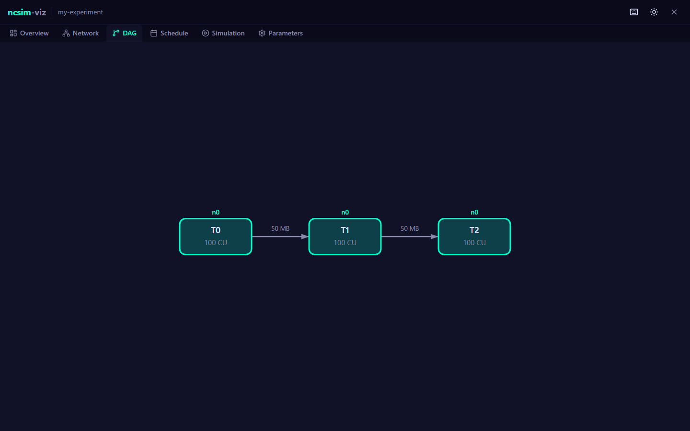
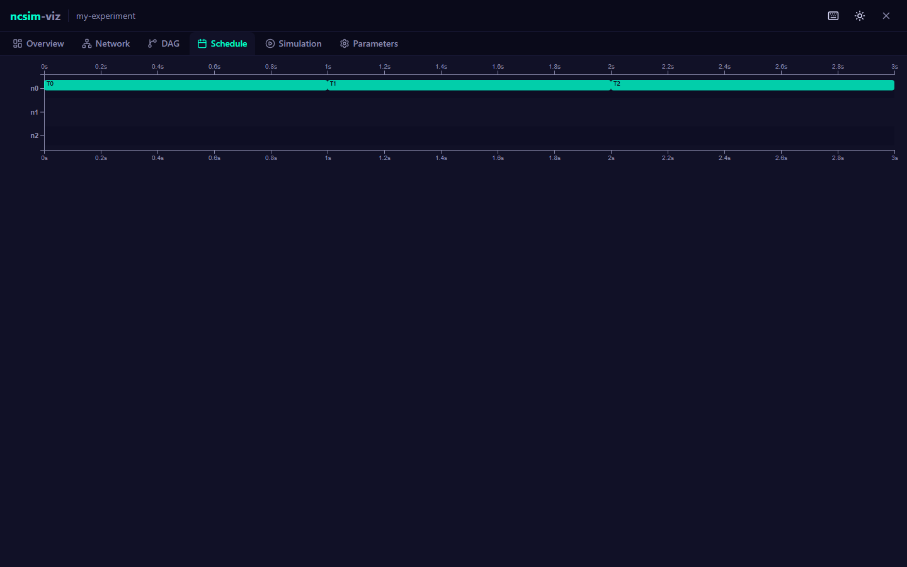
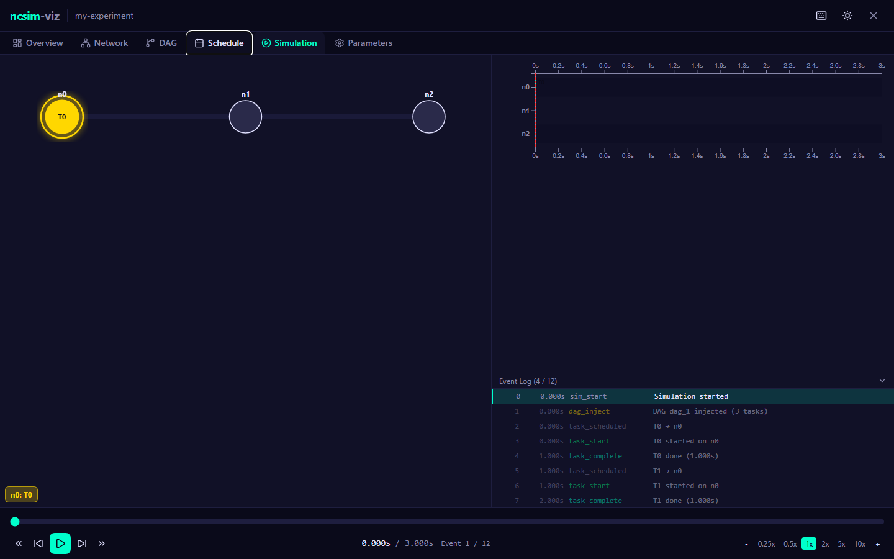
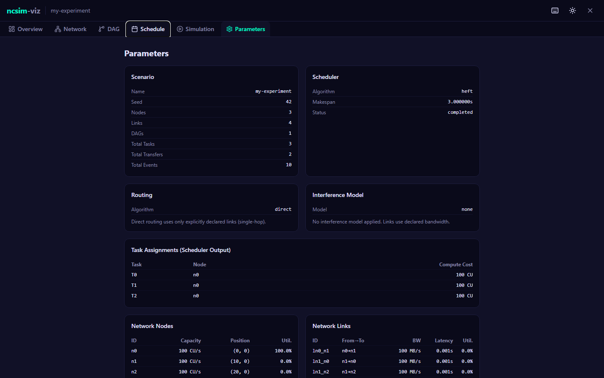

# Visualization Tabs

After running an experiment or loading saved results, ncsim-viz presents six visualization tabs. Switch between them by clicking the tab bar or pressing number keys ++1++ through ++6++.

---

## Overview Tab

The Overview tab provides a high-level dashboard of the experiment results.

### Header

Displays the scenario name along with key configuration metadata: scheduler algorithm, routing mode, interference model, and random seed.

### Metric Cards

Six summary cards are shown in a grid:

| Metric | Description |
|---|---|
| Makespan | Total simulation time from first event to last (seconds) |
| Tasks | Total number of tasks executed |
| Transfers | Total number of data transfers between nodes |
| Events | Total number of discrete events in the trace |
| Nodes | Number of compute nodes in the network |
| Links | Number of communication links in the network |

### Utilization Charts

Two side-by-side panels display per-resource utilization as horizontal bar charts:

- **Node Utilization** -- Percentage of the makespan each node spent executing tasks. Color varies by utilization level: accent color for moderate utilization (>30%), green for high utilization (>70%).
- **Link Utilization** -- Percentage of the makespan each link spent transferring data. If all tasks were assigned to the same node (no remote transfers), this panel shows a "No link utilization data" message.

### WiFi Configuration Summary

When a CSMA interference model was used, an additional panel displays the RF configuration parameters (TX power, frequency, path loss exponent, etc.) and the computed carrier sensing range.

---

## Network Tab

The Network tab renders an interactive D3-based visualization of the network topology.

### Node Rendering

- Nodes are drawn as circles **sized proportional to compute capacity** -- higher capacity nodes appear larger
- Node color reflects utilization: green for high utilization (>50%), themed color for moderate utilization (>10%), gray for low/unused nodes
- Each node is labeled with its ID above the circle and its capacity (CU/s) below

### Link Rendering

- Links are drawn as lines connecting their endpoint nodes
- Line thickness is **proportional to bandwidth** -- wider lines indicate higher bandwidth links
- Each link is labeled at its midpoint with the bandwidth value (MB/s)

### Interactions

| Action | Effect |
|---|---|
| Drag background | Pan the view |
| Scroll wheel | Zoom in/out (0.3x to 5x) |
| Hover over node | Shows tooltip with node ID, compute capacity, and utilization percentage |

!!! info "Responsive layout"
    The network graph automatically rescales when the browser window is resized. Node positions are computed from the `position` coordinates in the scenario YAML, mapped to screen space with padding.

---

## DAG Tab

The DAG tab shows the task dependency graph using a Dagre hierarchical layout with left-to-right flow direction.

### Task Nodes

- Each task is drawn as a rounded rectangle with the task ID and compute cost (CU)
- Tasks are **colored by their assigned compute node** -- tasks assigned to the same node share the same color, making it easy to see the scheduler's placement decisions
- A small badge above each task node shows the assigned node ID
- Unassigned tasks appear in gray

### Edges

- Edges represent data dependencies between tasks
- Edge labels show the data transfer size in MB
- Edges are drawn as curved spline paths with arrowheads indicating direction

### Interactions

| Action | Effect |
|---|---|
| Drag background | Pan the view |
| Scroll wheel | Zoom in/out (0.3x to 3x) |
| Hover over task | Shows tooltip with task ID, compute cost, assigned node, start time, and end time |

---

## Schedule Tab

The Schedule tab presents a static Gantt chart of the full simulation timeline.

### Axes

- **X-axis** (top and bottom): Simulation time in seconds, from 0 to the makespan
- **Y-axis**: Compute nodes, one row per node

### Task Bars

- Colored rectangles spanning each task's execution period on its assigned node
- Color matches the node's color scheme for consistency with other views
- Task IDs are displayed inside bars when there is sufficient width
- Hover over a task bar for a tooltip showing: task ID, node ID, start time, end time, and duration

### Transfer Bars

- Hatched (dashed-outline) rectangles below the task bars, representing data transfers
- Positioned on the source node's row
- Colored in magenta to visually distinguish transfers from compute tasks
- Hover over a transfer bar for a tooltip showing: source task, destination task, link ID, data size, start time, and end time

### Alternating Rows

Every other node row has a subtle background tint to improve readability when many nodes are present.

---

## Simulation Tab

The Simulation tab provides an animated event-by-event replay of the simulation, combining multiple synchronized views.

### Layout

The simulation view is split into three coordinated panels:

| Panel | Position | Content |
|---|---|---|
| Network overlay | Left (55% width) | Animated network graph with active-state highlighting |
| Live Gantt chart | Right top | Gantt chart that grows as the simulation progresses |
| Event log | Right bottom (collapsible) | Scrolling list of all trace events |

### Network Animation

During playback, the network graph shows real-time state changes:

- **Active nodes** (currently executing a task): highlighted in gold with a pulsing ring animation, with the current task name displayed inside the node circle
- **Completed nodes** (finished at least one task): shown in green with a checkmark and completed task count
- **Idle nodes**: shown in dim gray
- **Active links** (currently transferring data): shown in magenta with animated dashed lines and a glow effect, with the transfer label (source task to destination task) displayed at the link midpoint
- **Inactive links**: shown as faint lines

### Live Gantt Chart

The Gantt chart in the Simulation tab is time-synchronized with the playback:

- Task and transfer bars grow in real time as the simulation progresses
- A red vertical playhead line tracks the current simulation time
- Only events that have occurred up to the current time are visible

### Event Log

A scrolling log at the bottom-right displays every trace event:

| Column | Content |
|---|---|
| Sequence number | Event ordering index |
| Time | Simulation timestamp (seconds) |
| Type | Event type (e.g., `task_start`, `transfer_complete`) |
| Summary | Human-readable description of the event |

Events are color-coded by type:

- Green for `task_start`
- Accent color for `task_complete`
- Magenta for transfer events
- Yellow for `dag_inject`

The currently active event is highlighted with a left border. Click any event to jump the playback to that point in time. Future events (beyond the current playback time) appear dimmed.

!!! tip "Collapsible log"
    Click the "Event Log" header to collapse or expand the event log panel, giving more vertical space to the Gantt chart.

### Playback Controls

The transport bar at the bottom provides full playback control:

| Control | Description |
|---|---|
| Scrubber | Drag the slider to seek to any point in the simulation |
| Play / Pause | Toggle playback (also via ++space++ key) |
| Step backward / forward | Move to the previous or next event |
| Jump to start / end | Jump to time 0 or the makespan |
| Speed buttons | Select playback speed: 0.25x, 0.5x, 1x, 2x, 5x, or 10x |
| +/- buttons | Increment or decrement speed one step |

The time display shows the current time, total makespan, and current event index out of total events.

---

## Parameters Tab

The Parameters tab is a read-only inspector that displays the complete configuration and results of the experiment.

### Sections

The parameters are organized into collapsible sections:

**Scenario**

: Experiment name, seed, node count, link count, DAG count, total tasks, total transfers, total events.

**Scheduler**

: Algorithm name, computed makespan, simulation completion status.

**Routing**

: Algorithm name with a brief description of its behavior.

**Interference Model**

: Selected model name, radius (if proximity), and a description of the model's behavior.

**WiFi RF Configuration** *(shown only when CSMA model was used)*

: All PHY parameters: TX power, frequency, path loss exponent, noise floor, CCA threshold, channel width, WiFi standard, shadow fading sigma, RTS/CTS.

**Derived WiFi Values** *(shown only when CSMA model was used)*

: Carrier sensing range, per-link PHY rates (MB/s), and max clique sizes.

**Task Assignments**

: Table showing the scheduler's output: each task ID, its assigned node, and compute cost.

**Network Nodes**

: Table with each node's ID, compute capacity, position coordinates, and utilization percentage.

**Network Links**

: Table with each link's ID, endpoints, bandwidth, latency, and utilization percentage.

**DAG Edges**

: Table with each data dependency's source task, destination task, and data size.

---

## Next Steps

- **[Keyboard Shortcuts](keyboard-shortcuts.md)** -- Full reference for navigating the UI with the keyboard
- **[Configure & Run](configure-run.md)** -- Build a new experiment using the form editor
