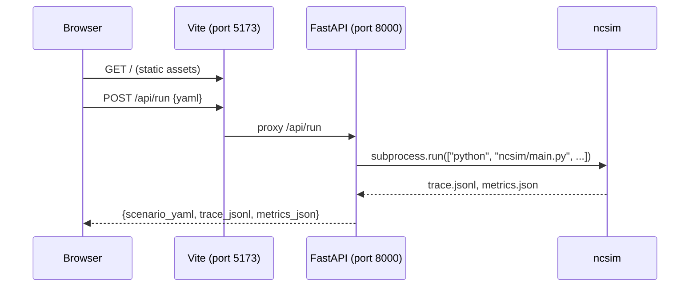

# Visualization Overview

**ncsim-viz** is a web-based UI for interactive experiment configuration and result visualization. It is not included in the PyPI package -- to use it, you must clone the [ncsim repository](https://github.com/ANRGUSC/ncsim).


---

## Architecture

ncsim-viz is a two-process application: a React frontend and a FastAPI backend.

| Layer | Technology | Default Port |
|---|---|---|
| Frontend | React 19 + TypeScript, Vite dev server, Tailwind CSS 4, D3.js 7 + Dagre, Lucide React icons | 5173 |
| Backend | FastAPI + uvicorn, runs ncsim via subprocess | 8000 |

The Vite development server proxies all `/api/*` requests to the FastAPI backend on port 8000. When the user submits a scenario, the frontend sends the generated YAML to the backend, which invokes the ncsim CLI as a subprocess and returns the scenario, trace, and metrics files to the browser.



---

## Workflow Modes

ncsim-viz supports two workflow modes, accessible from the home page:

### 1. Configure & Run

Build a scenario interactively using the form-based editor, submit it to the backend for execution, and visualize the results immediately. This mode requires both the frontend and backend servers to be running.

### 2. Visualize Existing

Browse saved experiments from the `sample-runs/` directory, or load your own output files (scenario YAML, trace JSONL, and metrics JSON). When browsing pre-generated sample runs, this mode can work with just the frontend server if the experiments are available as static files.

!!! info "Both modes lead to the same visualization"
    Regardless of how data is loaded, the same six visualization tabs are available once results are present.

---

## Visualization Tabs

After loading or running an experiment, the UI presents six tabs:

| Tab | Key | Description |
|---|---|---|
| Overview | ++1++ | Dashboard of key metrics: makespan, task/transfer counts, utilization bars, WiFi summary |
| Network | ++2++ | Interactive D3 force-directed graph of the network topology |
| DAG | ++3++ | Dagre hierarchical layout of the task dependency graph |
| Schedule | ++4++ | Static Gantt chart showing task execution and data transfers over time |
| Simulation | ++5++ | Animated event replay with live network overlay, growing Gantt, and event log |
| Parameters | ++6++ | Read-only inspector of the complete experiment configuration |

---

## Directory Structure

```
viz/
├── src/                  # React frontend
│   ├── App.tsx           # Main app shell with routing
│   ├── main.tsx          # React entry point
│   ├── components/
│   │   ├── home/         # HomePage: two-column layout, ExperimentBrowser
│   │   ├── configure/    # ExperimentForm, TopologySection, DagSection,
│   │   │                 # InterferenceSection, YamlPreview
│   │   ├── layout/       # AppShell, TabBar, ThemeToggle
│   │   ├── loader/       # FileLoader: manual file upload
│   │   ├── overview/     # OverviewPanel: summary metrics and utilization
│   │   ├── network/      # NetworkView: D3 force-directed graph, NodeTooltip
│   │   ├── dag/          # DagView: Dagre hierarchical layout, TaskTooltip
│   │   ├── gantt/        # GanttChart: static and animated D3 Gantt
│   │   ├── simulation/   # SimulationView, TimelineControls, EventLog
│   │   └── parameters/   # ParametersPanel: config inspector
│   ├── hooks/            # React hooks (useSimulation, usePlayback,
│   │                     # useRunExperiment, useExperiments)
│   ├── loaders/          # YAML / JSONL / JSON parsers
│   ├── engine/           # SimulationState: animation state machine
│   ├── theme/            # Color palette utilities
│   └── types/            # TypeScript interfaces (scenario, trace, metrics, api)
├── server/               # FastAPI backend
│   ├── main.py           # API endpoints (/api/run, /api/experiments)
│   ├── run.py            # Startup script (uvicorn launcher)
│   └── requirements.txt  # Python dependencies (fastapi, uvicorn)
├── public/
│   └── sample-runs/      # Pre-generated experiment results
├── vite.config.ts        # Vite config with /api proxy to port 8000
├── package.json          # npm dependencies and scripts
└── tsconfig.json         # TypeScript configuration
```

---

## API Endpoints

The FastAPI backend exposes three endpoints:

| Method | Path | Description |
|---|---|---|
| `GET` | `/api/experiments` | List all saved experiments in `sample-runs/` with summary metadata |
| `GET` | `/api/experiments/{name}` | Load all files (scenario YAML, trace JSONL, metrics JSON) for a specific experiment |
| `POST` | `/api/run` | Run ncsim with the provided scenario YAML and return results |

!!! note "Sequential execution"
    The backend uses a lock to ensure only one ncsim subprocess runs at a time. Concurrent run requests will queue behind the lock. Simulations time out after 60 seconds.

---

## Next Steps

- **[Viz Setup](setup.md)** -- Install dependencies and start the servers
- **[Configure & Run](configure-run.md)** -- Walkthrough of the experiment configuration form
- **[Visualization Tabs](visualization-tabs.md)** -- Detailed guide to each visualization tab
- **[Keyboard Shortcuts](keyboard-shortcuts.md)** -- Full shortcut reference
